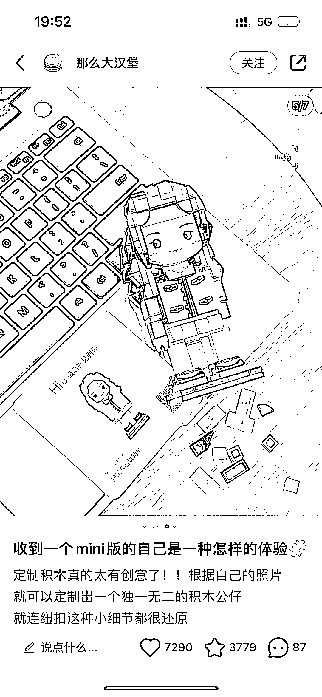
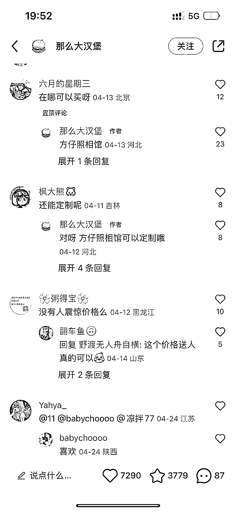

# 小红书照片定制积木，市场售价 100-300 区间

> 原文：[`www.yuque.com/for_lazy/xkrm14/ob4fiehu608euo46`](https://www.yuque.com/for_lazy/xkrm14/ob4fiehu608euo46)

<ne-text id="u4b39e958">作者： 瑾糖</ne-text>

<ne-text id="uefd8a933">日期：2023-05-02</ne-text>

<ne-text id="u8db5fa97">点赞数：</ne-text><ne-text id="u5f54418e" ne-bold="true">113</ne-text>

<ne-hole id="u28c05ad8" data-lake-id="u28c05ad8"><ne-card data-card-name="hr" data-card-type="block" id="xPjlH" data-event-boundary="card">

<ne-text id="uaaf8a5a5">正文：</ne-text>

<ne-text id="u2696b7fd">照片定制积木，市场售价 100-300 区间</ne-text>

<ne-card data-card-name="image" data-card-type="inline" id="M2bdw" data-event-boundary="card">  <ne-p id="u5e98a1c4" data-lake-id="u5e98a1c4"><ne-card data-card-name="image" data-card-type="inline" id="nMCQH" data-event-boundary="card">  <ne-hole id="u0207d69c" data-lake-id="u0207d69c"><ne-card data-card-name="hr" data-card-type="block" id="kHvU4" data-event-boundary="card"><ne-p id="uf71c57a6" data-lake-id="uf71c57a6"><ne-text id="u99acecd8">评论区：</ne-text>

<ne-text id="u8f6894a3">朱朱侠 : 有意思，去年在淘宝买过一个用各种颜色的钉子拼成的画，画的内容可以根据自己的照片进行个性化定制，积木也是这个变形。</ne-text>

<ne-text id="u883f278c">喝茶不加糖 : 第一次看到是在明侦最后一期上，当时也觉得是个口，没对接到</ne-text>

<ne-text id="uf4967e5b">lalalaLiz : 图上这个应该是清华，港中文学生创业做的项目，方仔照相馆，上传自己照片直接定制。</ne-text>

<ne-text id="u3d158174">瑾糖 : 是的，入口公众号搜索：方仔照相馆；可以利用这个信息差去给别人定制。</ne-text>

<ne-text id="u43a61c94">🌸猫本红豆冰🌟 : 喜欢😘</ne-text>

<ne-text id="u1a450d76">修灵君 : [强]</ne-text>

<ne-text id="uef0c5a06">姬小光 : 深圳路边还有拍照后机械手臂现场用乐高拼画出来</ne-text>

<ne-hole id="ufd49ae8b" data-lake-id="ufd49ae8b"><ne-card data-card-name="hr" data-card-type="block" id="uzBdG" data-event-boundary="card">

<ne-text id="u6d452653">公众号懒人找资源，懒人专属群分享</ne-text>

</ne-card></ne-hole></ne-card></ne-hole></ne-card></ne-p></ne-card></ne-p></ne-card></ne-hole>