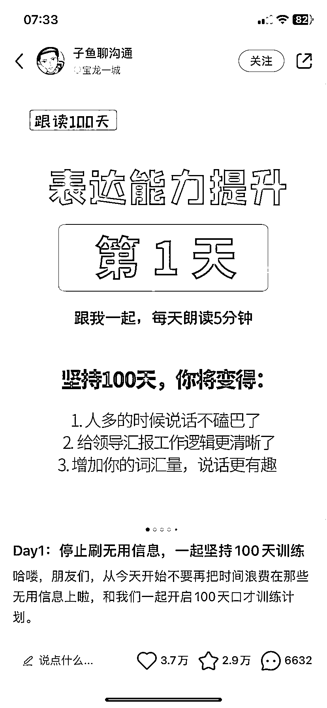
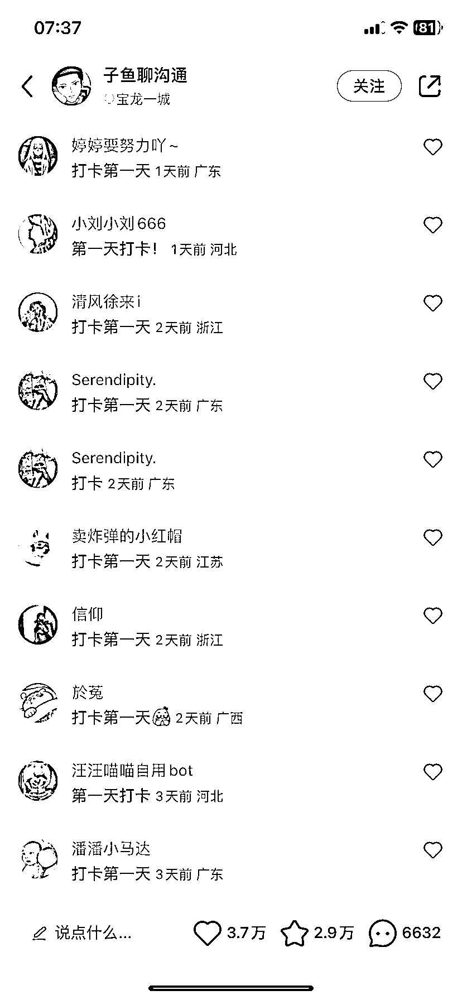
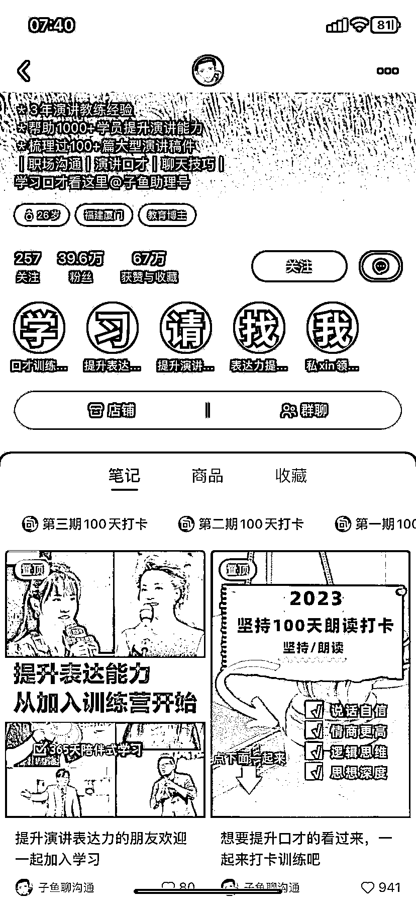

# 小红书打卡类图文爆发力非常强，点赞、收藏和留言非常多

> 原文：[`www.yuque.com/for_lazy/xkrm14/yu909ghresvbn2i3`](https://www.yuque.com/for_lazy/xkrm14/yu909ghresvbn2i3)

<ne-text id="ucc445c7a">作者： 浮沉</ne-text>

<ne-text id="ub8d0b497">日期：2023-05-01</ne-text>

<ne-text id="uf0d101a7">点赞数：</ne-text><ne-text id="u06f6320b" ne-bold="true">51</ne-text>

<ne-hole id="u8e7e1f74" data-lake-id="u8e7e1f74"><ne-card data-card-name="hr" data-card-type="block" id="Vxlxi" data-event-boundary="card">

<ne-text id="u4f81ef6d">正文：</ne-text>

<ne-text id="u52d88c6f">小红书打卡类图文爆发力非常强，点赞、收藏和留言非常多，对于新手小白来说很简单，大家可以尝试操作一下。 后续可以通过收费社群打卡变现，接广告变现等变现方式。</ne-text>

<ne-card data-card-name="image" data-card-type="inline" id="a9F2v" data-event-boundary="card">  <ne-p id="u1742903f" data-lake-id="u1742903f"><ne-card data-card-name="image" data-card-type="inline" id="Mm9hm" data-event-boundary="card"></ne-card>

<ne-card data-card-name="image" data-card-type="inline" id="koYHJ" data-event-boundary="card"></ne-card>

<ne-card data-card-name="image" data-card-type="inline" id="l8OIb" data-event-boundary="card">  <ne-hole id="u0a2ff2b4" data-lake-id="u0a2ff2b4"><ne-card data-card-name="hr" data-card-type="block" id="N2AA5" data-event-boundary="card"><ne-p id="u2e92f6e6" data-lake-id="u2e92f6e6"><ne-text id="uffa4cd3d">评论区：</ne-text>

<ne-text id="u195c52dd">田新一 : 这不就是我们圈友的账号么[呲牙]</ne-text>

<ne-text id="u04cfc850">浮沉 : 啊，是么？我还真不知道[呲牙]</ne-text>

<ne-text id="uf0c9718d">南哥 : 这个是圈友的号</ne-text>

<ne-text id="u7eb88413">浮沉 : 厉害了👍</ne-text>

<ne-text id="u820e12c9">浮沉 : [抱拳]感谢亦仁大佬</ne-text>

<ne-hole id="u2335a4e9" data-lake-id="u2335a4e9"><ne-card data-card-name="hr" data-card-type="block" id="HU7a3" data-event-boundary="card">

<ne-text id="udc8a52e7">公众号懒人找资源，懒人专属群分享</ne-text>

</ne-card></ne-hole></ne-card></ne-hole></ne-card></ne-p></ne-card></ne-p></ne-card></ne-hole>