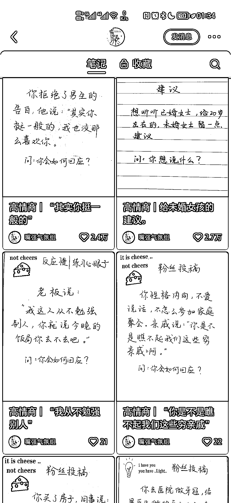

# 小红书“问题抛出来，想知道的会关注看后续”，评论区留言引流

> 原文：[`www.yuque.com/for_lazy/xkrm14/nxxh3gccbmhbxkt5`](https://www.yuque.com/for_lazy/xkrm14/nxxh3gccbmhbxkt5)

作者： 踏歌

日期：2023-04-29

点赞数：67

<ne-hole id="uc9415183" data-lake-id="uc9415183"><ne-card data-card-name="hr" data-card-type="block" id="Evo6N" data-event-boundary="card">

正文：

问题抛出来，想知道的会关注看后续，有高见自来水会兴奋的在评论区留下神评，躺赢

<ne-card data-card-name="image" data-card-type="inline" id="zRTQX" data-event-boundary="card"></ne-card>

<ne-hole id="u4d06021e" data-lake-id="u4d06021e"><ne-card data-card-name="hr" data-card-type="block" id="A2HlI" data-event-boundary="card">

评论区：

何必怀念 : 这种如何变现呢

楚菲 : 我第一个想到的是卖书

踏歌 : 是的，她的主页简介是成长，职场心得，高情商，读书和好物分享，可以卖书和带货

<ne-hole id="uccbfc24b" data-lake-id="uccbfc24b"><ne-card data-card-name="hr" data-card-type="block" id="aorHS" data-event-boundary="card">

公众号懒人找资源，懒人专属群分享

</ne-card></ne-hole></ne-card></ne-hole></ne-card></ne-hole>