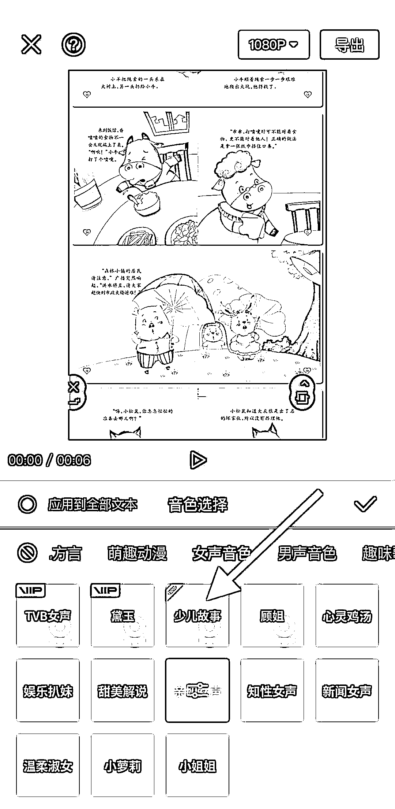
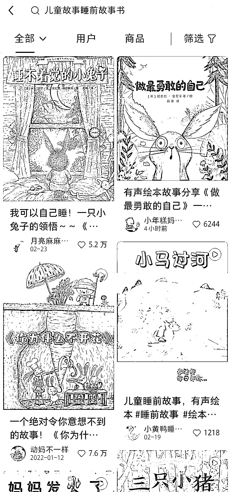
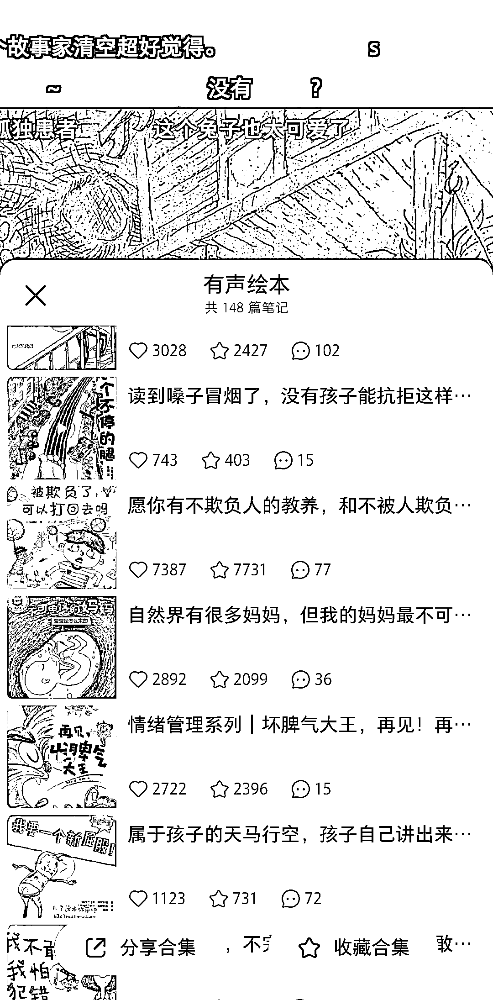

# 小红书将儿童绘本图片导入剪映，输入文字用“少儿故事”的朗读音朗读效果不错

> 原文：[`www.yuque.com/for_lazy/xkrm14/uybm7fn6sm7ufvhh`](https://www.yuque.com/for_lazy/xkrm14/uybm7fn6sm7ufvhh)

<ne-p id="u747aeedd" data-lake-id="u747aeedd"><ne-text id="ud1215555">作者： 11</ne-text></ne-p> <ne-p id="u9dc41156" data-lake-id="u9dc41156"><ne-text id="ua49f2772">日期：2023-04-26</ne-text></ne-p> <ne-p id="uc284811f" data-lake-id="uc284811f"><ne-text id="u1bf815ad">点赞数：</ne-text><ne-text id="ub45e05fc" ne-bold="true">151</ne-text></ne-p> <ne-hole id="uc4b6293d" data-lake-id="uc4b6293d"><ne-card data-card-name="hr" data-card-type="block" id="bh4gX" data-event-boundary="card"><ne-p id="u21a92283" data-lake-id="u21a92283"><ne-text id="u678f5334">正文：</ne-text></ne-p> <ne-p id="u783464a3" data-lake-id="u783464a3"><ne-text id="u284bc071">将儿童绘本图片导入剪映，输入文字，用“少儿故事”的朗读音朗读出来，导出就是有声绘本了。发小红书上数据都不错，评论区也很多要电子音频和图册的</ne-text></ne-p> <ne-p id="ud55c5515" data-lake-id="ud55c5515"><ne-card data-card-name="image" data-card-type="inline" id="hE9y3" data-event-boundary="card">  <ne-p id="u9207ddac" data-lake-id="u9207ddac"><ne-card data-card-name="image" data-card-type="inline" id="TUbBl" data-event-boundary="card">  <ne-p id="u369d7c3e" data-lake-id="u369d7c3e"><ne-card data-card-name="image" data-card-type="inline" id="kN8eU" data-event-boundary="card">  <ne-hole id="u6603a11d" data-lake-id="u6603a11d"><ne-card data-card-name="hr" data-card-type="block" id="iWXtm" data-event-boundary="card"><ne-p id="uc7eb0791" data-lake-id="uc7eb0791"><ne-text id="u74c11569">评论区：</ne-text></ne-p> <ne-p id="u507be1db" data-lake-id="u507be1db"><ne-text id="u74c50631">华华 : 这个引流到私域，怎么发资料给别人呀</ne-text></ne-p> <ne-p id="u4fe46130" data-lake-id="u4fe46130"><ne-text id="ubbd7f222">11 : 可以用网盘链接哇，夸克网盘现在还有拉新，顺便做个拉新</ne-text></ne-p> <ne-p id="ueede0ca1" data-lake-id="ueede0ca1"><ne-text id="u8d844fdc">华华 : 就是资料去哪里找呢？没有绘本的音频啊</ne-text></ne-p> <ne-p id="ub02e963c" data-lake-id="ub02e963c"><ne-text id="ud2d1bd6a">11 : 淘宝拼多多有很多卖电子绘本的，价格也不高，用剪映导入绘本图片，朗读文字转成音频</ne-text></ne-p> <ne-p id="udbf64ac7" data-lake-id="udbf64ac7"><ne-text id="uf718768e">华华 : 好哒，感谢啦👍♥️</ne-text></ne-p> <ne-p id="uf563e62a" data-lake-id="uf563e62a"><ne-text id="u45989ee7">11 : 不客气哇，我也很多还在学习[呲牙]</ne-text></ne-p> <ne-p id="u1861003e" data-lake-id="u1861003e"><ne-text id="ua1875461">胡北北 : 这个很棒啊</ne-text></ne-p> <ne-p id="ua094dcb9" data-lake-id="ua094dcb9"><ne-text id="uf764755c">11 : 看着是还不错的样子😝</ne-text></ne-p> <ne-hole id="uea2f6712" data-lake-id="uea2f6712"><ne-card data-card-name="hr" data-card-type="block" id="M1Fmk" data-event-boundary="card"><ne-p id="ud3fdb59c" data-lake-id="ud3fdb59c"><ne-text id="ubdc873f0">公众号懒人找资源，懒人专属群分享</ne-text></ne-p></ne-card></ne-hole></ne-card></ne-hole></ne-card></ne-p></ne-card></ne-p></ne-card></ne-p></ne-card></ne-hole>