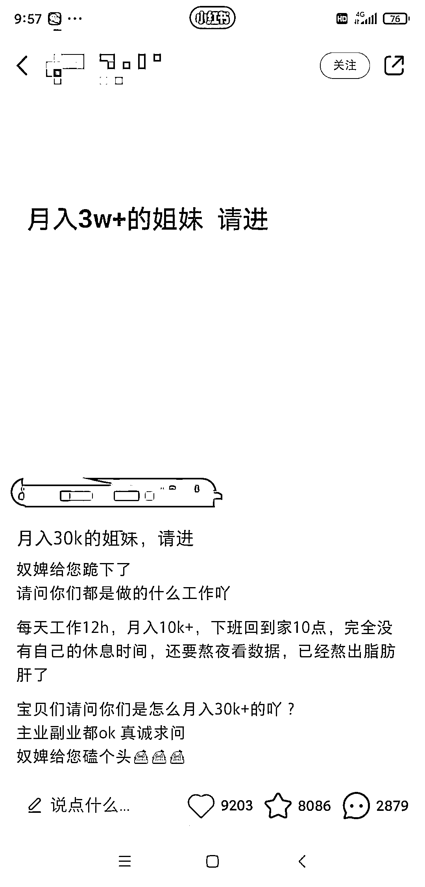
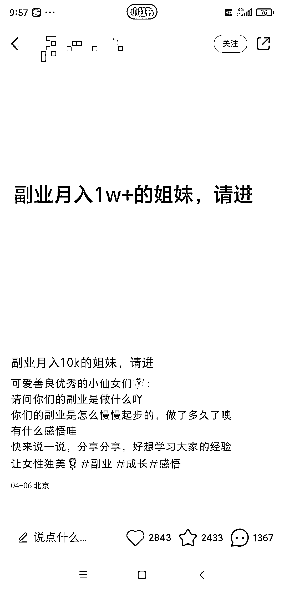
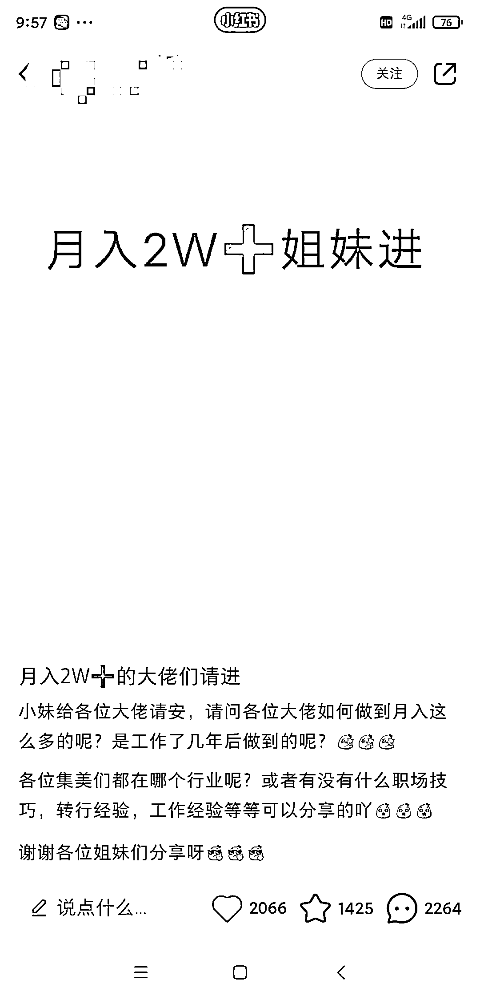

# 小红书流量玩法， 引起用户对于别人如何挣钱的好奇心

> 原文：[`www.yuque.com/for_lazy/xkrm14/btgxygpg2rm4fytt`](https://www.yuque.com/for_lazy/xkrm14/btgxygpg2rm4fytt)

作者： 发强

日期：2023-04-24

点赞数：100

<ne-hole id="u02b9be63" data-lake-id="u02b9be63">

正文：

小红书流量玩法， 引起用户对于别人如何挣钱的好奇心，进来围观，寻找个人机会，进而参与讨论， 评论区可以引流兼职粉，副业粉.

  <ne-hole id="u5cfe1f54" data-lake-id="u5cfe1f54"><ne-p id="ube20f916" data-lake-id="ube20f916">评论区：

<ne-hole id="uc4c511cf" data-lake-id="uc4c511cf">

公众号懒人找资源，懒人专属群分享

</ne-hole></ne-hole></ne-p></ne-hole>