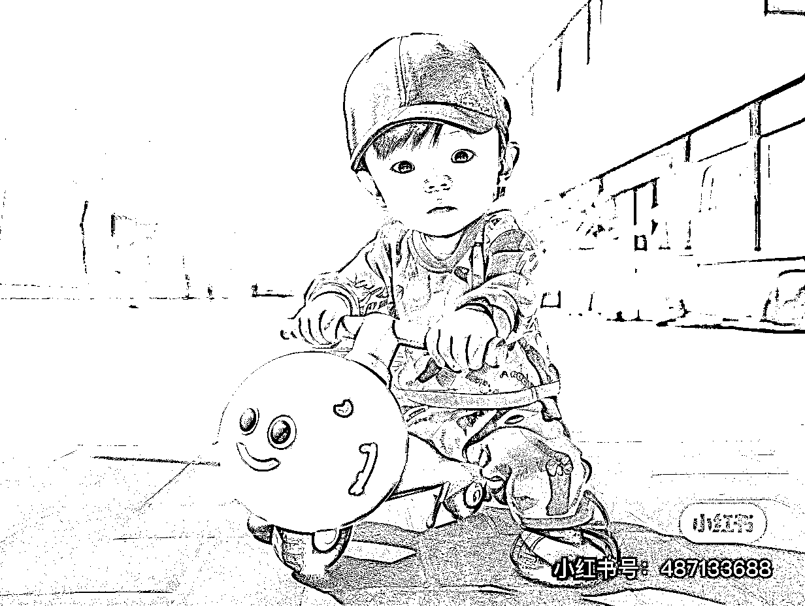
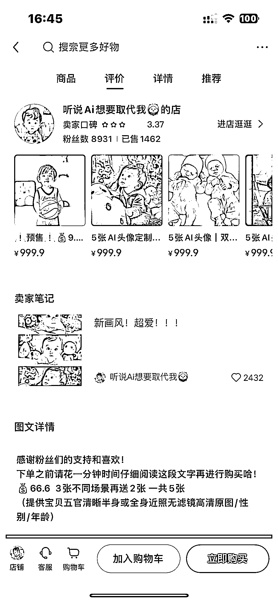

# 9.9 元在小红书卖了 1200 单，收入 10000+

> 原文：[`www.yuque.com/for_lazy/xkrm14/oneqlgc0d6811w5b`](https://www.yuque.com/for_lazy/xkrm14/oneqlgc0d6811w5b)

<ne-p id="u7d7f68f7" data-lake-id="u7d7f68f7"><ne-text id="u58c19585">作者： 张义维</ne-text></ne-p> <ne-p id="u5f3aa6d5" data-lake-id="u5f3aa6d5"><ne-text id="uf60f619e">日期：2023-04-24</ne-text></ne-p> <ne-p id="ucc3c64ba" data-lake-id="ucc3c64ba"><ne-text id="u4b0629c6">点赞数：</ne-text><ne-text id="u5209bced" ne-bold="true">147</ne-text></ne-p> <ne-hole id="ub5217b35" data-lake-id="ub5217b35"><ne-card data-card-name="hr" data-card-type="block" id="nhlLf" data-event-boundary="card"><ne-p id="u9a9357bc" data-lake-id="u9a9357bc"><ne-text id="u79bfacab">正文：</ne-text></ne-p> <ne-p id="u2f7483be" data-lake-id="u2f7483be"><ne-text id="u886fdc58">9.9 元 在小红书卖了 1200 单，收入 10000+，[强]</ne-text></ne-p> <ne-p id="u78281b01" data-lake-id="u78281b01"><ne-card data-card-name="image" data-card-type="inline" id="NrF2m" data-event-boundary="card">  <ne-p id="u6b14c5c3" data-lake-id="u6b14c5c3"><ne-card data-card-name="image" data-card-type="inline" id="qC8PY" data-event-boundary="card">  <ne-p id="ub0d01c33" data-lake-id="ub0d01c33"><ne-card data-card-name="image" data-card-type="inline" id="DUXCO" data-event-boundary="card">  <ne-p id="ua501d5cf" data-lake-id="ua501d5cf"><ne-card data-card-name="image" data-card-type="inline" id="AfBeU" data-event-boundary="card">  <ne-p id="u0c98c49e" data-lake-id="u0c98c49e"><ne-card data-card-name="image" data-card-type="inline" id="h3dpJ" data-event-boundary="card">  <ne-hole id="ub1e08f7f" data-lake-id="ub1e08f7f"><ne-card data-card-name="hr" data-card-type="block" id="JpY8X" data-event-boundary="card"><ne-p id="ucb9e4844" data-lake-id="ucb9e4844"><ne-text id="u69e4eca6">评论区：</ne-text></ne-p> <ne-p id="uc125e07f" data-lake-id="uc125e07f"><ne-text id="u4f1f8c2f">饭饭 : 这个牛</ne-text></ne-p> <ne-p id="u9ee895ea" data-lake-id="u9ee895ea"><ne-text id="u450db04e">纪言🍃 : 牛</ne-text></ne-p> <ne-p id="uae8c8e49" data-lake-id="uae8c8e49"><ne-text id="u99b60f54">小侯的王先生 : 直接照抄[色]</ne-text></ne-p> <ne-p id="ud23fd040" data-lake-id="ud23fd040"><ne-text id="u03a33529">生财青蛙 : 跟随</ne-text></ne-p> <ne-p id="u1adf41d4" data-lake-id="u1adf41d4"><ne-text id="u0dd03373">创业老杨 : 效果如何</ne-text></ne-p> <ne-p id="u2932563c" data-lake-id="u2932563c"><ne-text id="ue94ec8ce"> 桥豆麻袋 : 好厉害！</ne-text></ne-p> <ne-p id="ub999457b" data-lake-id="ub999457b"><ne-text id="uc7f458ff">Mr.小明 : 厉害，抓住了小孩这个群体</ne-text></ne-p> <ne-hole id="ue8b62373" data-lake-id="ue8b62373"><ne-card data-card-name="hr" data-card-type="block" id="Cvqis" data-event-boundary="card"><ne-p id="u7bd08570" data-lake-id="u7bd08570"><ne-text id="u368f64fa">公众号懒人找资源，懒人专属群分享</ne-text></ne-p></ne-card></ne-hole></ne-card></ne-hole></ne-card></ne-p></ne-card></ne-p></ne-card></ne-p></ne-card></ne-p></ne-card></ne-p></ne-card></ne-hole>