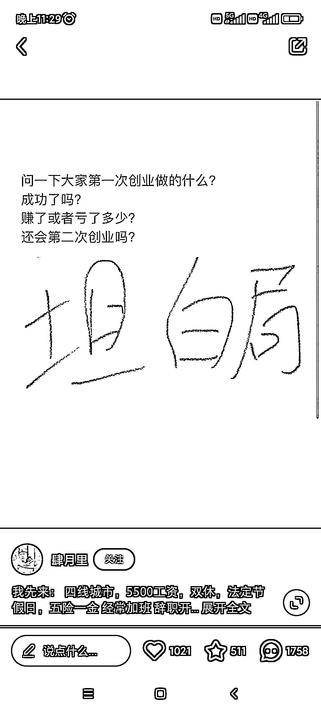
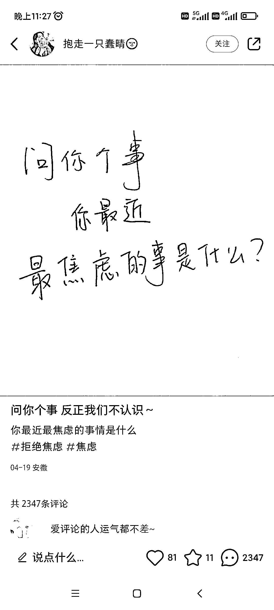

# 小红书爆火文案手写体，互动效果很好

> 原文：[`www.yuque.com/for_lazy/xkrm14/vri96i17r2a2obpm`](https://www.yuque.com/for_lazy/xkrm14/vri96i17r2a2obpm)

作者： 六妹

日期：2023-04-24

点赞数：127

<ne-hole id="u64b7dc57" data-lake-id="u64b7dc57"><ne-card data-card-name="hr" data-card-type="block" id="vOG2Y" data-event-boundary="card">

正文：

小红书爆火文案-手写体-互动性 用具有互动性的标题，简单，直观的呈现出来，可以直接自己写一个。评论区会特别热闹！ 大家会觉得反正小红书上大家都不认识，可以更轻松的聊天，这和当时最开始有 qq 时一样，网友之间无话不谈，反倒是身边人常常闭口不言。不要小瞧人的表达欲，毕竟内心的话总要找地方倾诉，而 qq 和微信已经被朋友亲人占满了。于是小红书成了新的表达出口。

<ne-card data-card-name="image" data-card-type="inline" id="Eq9V7" data-event-boundary="card"></ne-card>

<ne-card data-card-name="image" data-card-type="inline" id="ypp2C" data-event-boundary="card">  <ne-p id="u441fbb0c" data-lake-id="u441fbb0c"><ne-card data-card-name="image" data-card-type="inline" id="PEsQ0" data-event-boundary="card"></ne-card>

<ne-hole id="u308ce470" data-lake-id="u308ce470"><ne-card data-card-name="hr" data-card-type="block" id="ibPTW" data-event-boundary="card">

评论区：

六妹 : 谢谢亦仁大大，开心！第一次中标，相信以后还会有很多次的

财女小马达 : 一看到问题就想回答，本能

羽上侠凌 : 不错，新的思路

女爵🕊 : 刚发了一条，流量棒呆了！

汉其 : 明天就发一条

逍遥公子 : 你明天发吧，我今天说啥都得发出去。[坏笑]

志存高远 : 可是怎么变现呢？

<ne-hole id="u3a9b9f76" data-lake-id="u3a9b9f76"><ne-card data-card-name="hr" data-card-type="block" id="KJ2PF" data-event-boundary="card">

公众号懒人找资源，懒人专属群分享

</ne-card></ne-hole></ne-card></ne-hole></ne-card></ne-p></ne-card></ne-hole>