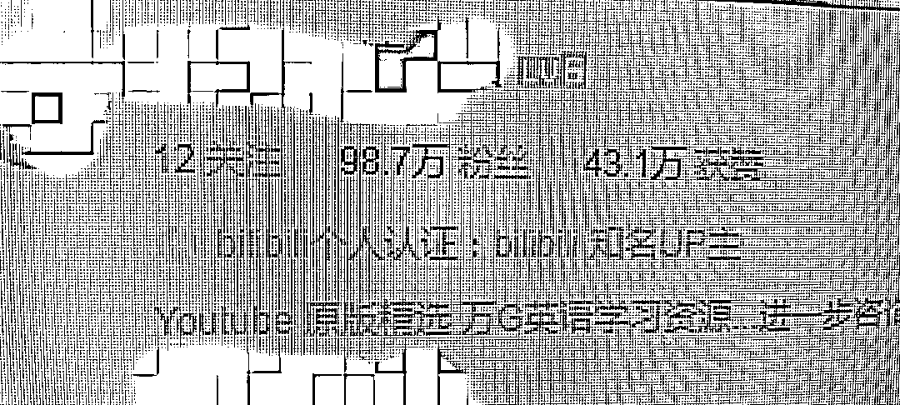

# 将 YouTube 的视频下载上传到 b 站吸粉，引流卖教材

> 原文：[`www.yuque.com/for_lazy/xkrm14/fqy79qltlnff05an`](https://www.yuque.com/for_lazy/xkrm14/fqy79qltlnff05an)

<ne-text id="ucf810bd9">作者： 老风</ne-text>

<ne-text id="u240eaa1e">日期：2023-04-29</ne-text>

<ne-text id="uc4ac1d66">点赞数：</ne-text><ne-text id="uaeead839" ne-bold="true">47</ne-text>

<ne-hole id="u4d582cd3" data-lake-id="u4d582cd3"><ne-card data-card-name="hr" data-card-type="block" id="Z5QqL" data-event-boundary="card">

<ne-text id="u40b59835">正文：</ne-text>

<ne-text id="u0e3b8f8b">将 YouTube 的视频下载，再上传到 b 站吸粉，引流至微信卖国外教材</ne-text>

<ne-card data-card-name="image" data-card-type="inline" id="fzqoN" data-event-boundary="card"></ne-card>

<ne-hole id="u69e92281" data-lake-id="u69e92281"><ne-card data-card-name="hr" data-card-type="block" id="KbweP" data-event-boundary="card">

<ne-text id="ua9f11687">评论区：</ne-text>

<ne-text id="uaccdfb77">刺客 : 需要翻译成中文吗？</ne-text>

<ne-text id="u52fd4b31">PONY : 这个 up 是谁啊，可以告知一下吗，感激不尽</ne-text>

<ne-text id="uf4eac644">Mia 米娅 : 搬运哈</ne-text>

<ne-text id="uded00898">Marie : 这样侵权吗？</ne-text>

<ne-text id="uaccb75f6">Choco : 同问</ne-text>

<ne-text id="u07bde9f2">陈文轩 : 同文</ne-text>

<ne-hole id="u918fac7e" data-lake-id="u918fac7e"><ne-card data-card-name="hr" data-card-type="block" id="sTW2m" data-event-boundary="card">

<ne-text id="u8440957e">公众号懒人找资源，懒人专属群分享</ne-text>

</ne-card></ne-hole></ne-card></ne-hole></ne-card></ne-hole>