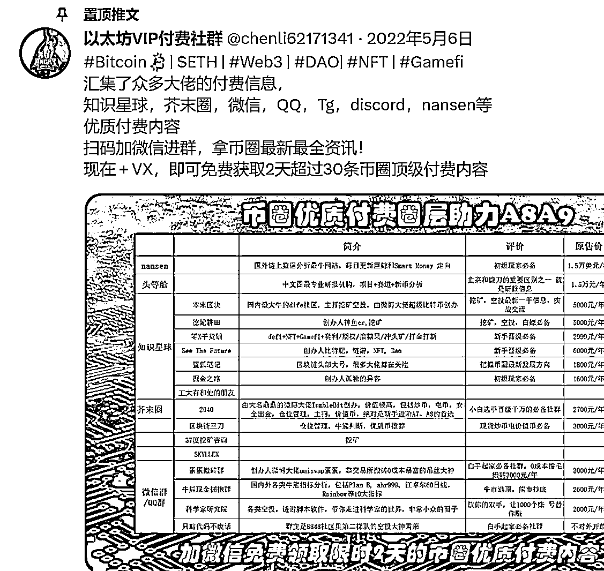
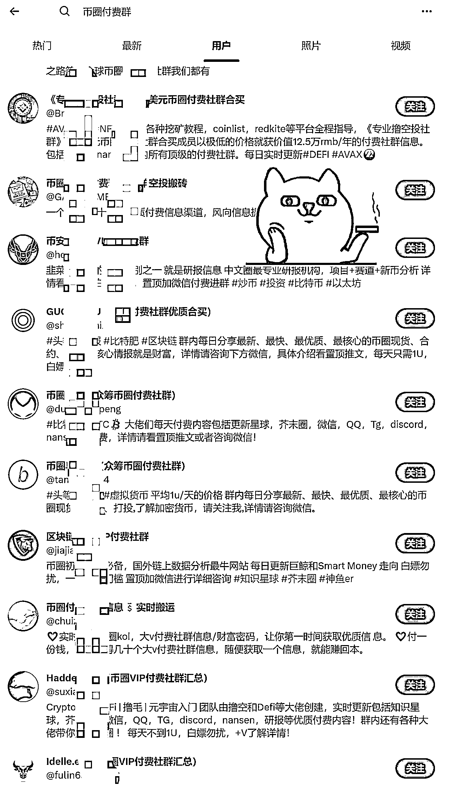

# Web3 付费群共享模式赚千万，蹭 kol 流量，留言引流

> 原文：[`www.yuque.com/for_lazy/xkrm14/ecv807uluqb0gvsy`](https://www.yuque.com/for_lazy/xkrm14/ecv807uluqb0gvsy)

作者： 修心阿

日期：2023-04-24

点赞数：63

正文：

web3 付费群共享模式赚千万，蹭 kol 流量，留言引流。 有这么一圈人或者说是一个群体有着成百上千个小号，关注推上的 kol，然后每条推上留言。就这么简单的引流方式去做付费社群加的人还不少，据说千万营收。成本只是加币圈几个知名的付费群然后把内容同步给其他付费者。价格相对优惠。一份的价格享受 10 家付费内容。看着不起眼，实则赚钱嘎嘎猛。币圈小白对信息的渴求是极其旺盛的，有着很强的付费需求。这个钱赚的是很舒服的做聚合付费社群，客单价 2000 左右。这个项目是一点门槛都没有。买一份同样操作，一个付费就回本剩下都是赚的，顺便还可以组建自己的社群。一招鲜吃遍天，高端的食材往往朴实无华，大多数老韭菜看不上做这事的人但不影响人家赚钱。此思路可拓展多领域不局限于付费群。单从赚钱角度讲 付费群 希望可以给大家一点启发，这套在别的圈子可能差点意思但在 web3 领域刚刚好

  

  

评论区：

生财青蛙 : 去年加了几个这样的社群

修心阿 : 可以的[偷笑]

湛术 : 没太懂 他从外网引流为啥还要引流进微信呢 不怕被封吗

修心阿 : 为啥怕封呢。一好收款，二，要交付的呀便于管理。三进微信是私🐟。在哪引流和被封没关系，被封是违反微信使用规则。

湛术 : 好友加多了就容易被封 哪怕是被添加 微信封起来不讲道理的

修心阿 : 一个人 2000 你怕啥被封不行多备用几个号呗，你真可爱流量爆了一个微信算什么，解决方案很多。

秋冬。 : 币圈的知识付费贩子[强]，目前世面的知识付费贩子绝大多数都是做网赚项目，跟一些个人课程。

公众号懒人找资源，懒人专属群分享

