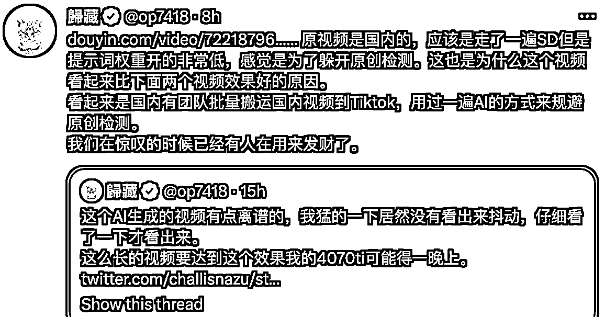

# 将抖音上爆火的视频，通过 AI 方式规避原创检测，搬运到 Tiktok

> 原文：[`www.yuque.com/for_lazy/xkrm14/kagb3ymuvtk5nl37`](https://www.yuque.com/for_lazy/xkrm14/kagb3ymuvtk5nl37)

作者： Fisher

日期：2023-04-24

点赞数：122

<ne-hole id="u1b9379b0" data-lake-id="u1b9379b0">

正文：

AI 洗稿 将抖音上爆火的视频，通过过一遍 AI 的方式来规避原创检测，搬运到 Tiktok， 我们在惊叹的时候已经有人在用来发财了。 Tiktok 上电影解说也可以用 AI 翻译+TTS，做成多国语言版本分发。

  <ne-hole id="u744ce71a" data-lake-id="u744ce71a"><ne-p id="ucf348c1b" data-lake-id="ucf348c1b">评论区：

孟大富 : 看到了那个视频，不注意看完全看不出来

财女小马达 : [强]火过的即是被验证过的

睡觉想飞 : 这个昨晚在推特上看到,没找到咋实现的

林清杰 : 把视频每帧都拆下来成图片批量重绘再合起来吗

迷途小书童的 Note : 能给个完整是链接吗？

Fisher : 可以参考 ControlNET to Video 这个视频基本上只是原版视频 AI 稍微修饰了一下，prompt 的权重很小

Fisher : [https://www.douyin.com/video/7221879632914550077](https://www.douyin.com/video/7221879632914550077)

<ne-hole id="uef0f82b3" data-lake-id="uef0f82b3">

公众号懒人找资源，懒人专属群分享

</ne-hole></ne-hole></ne-p></ne-hole>