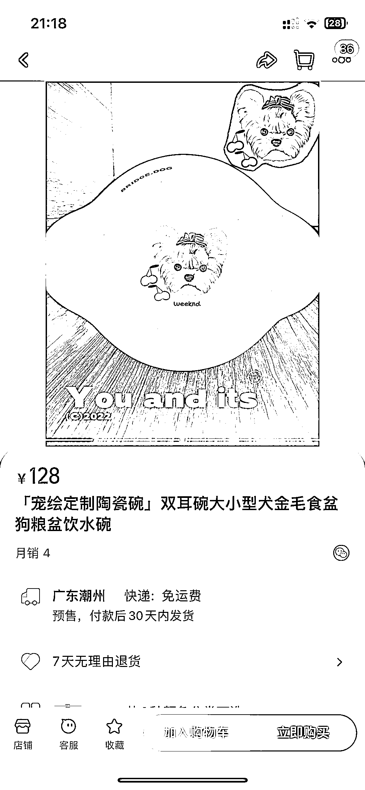
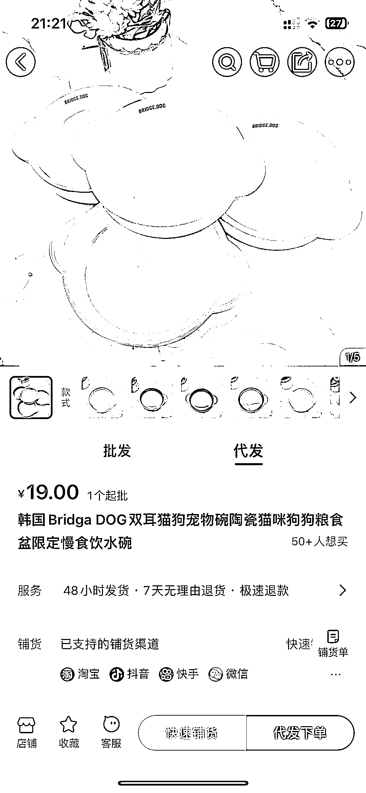
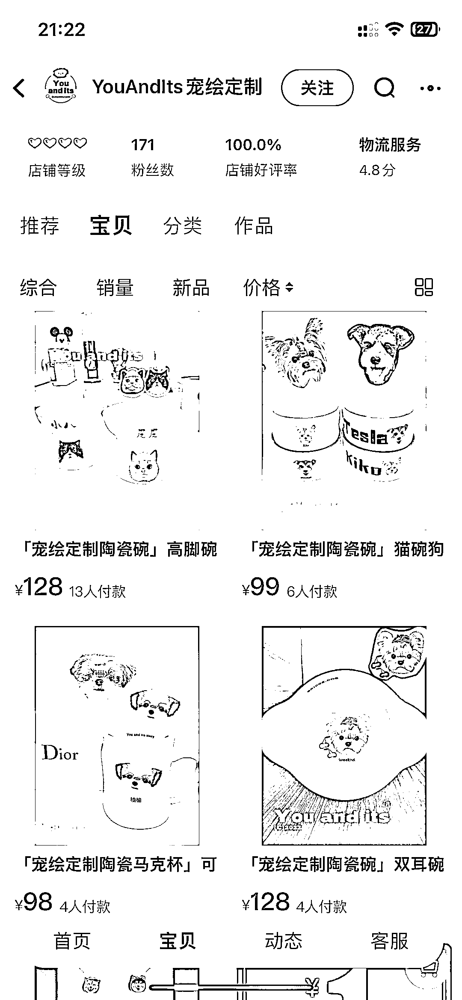
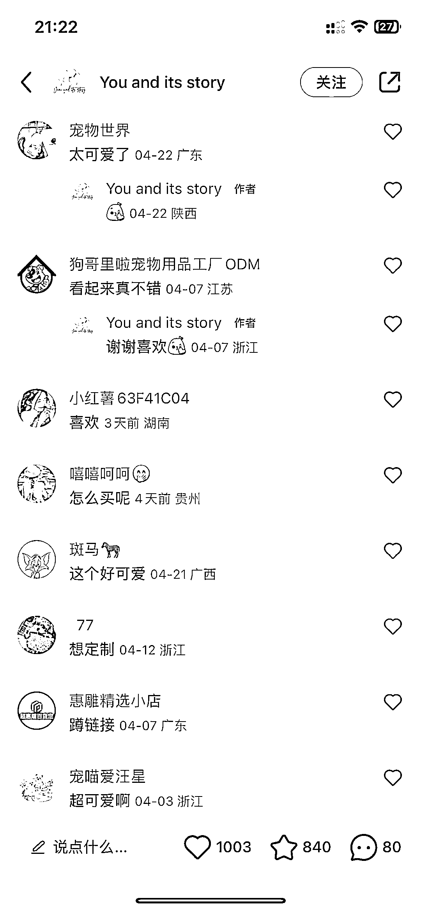
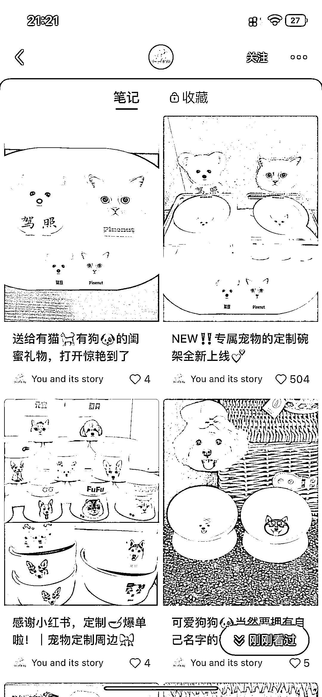
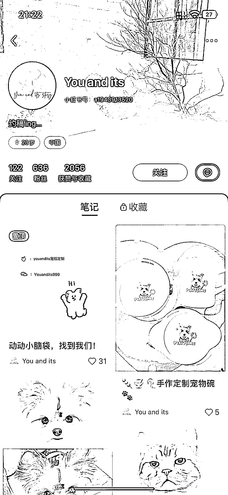

# 宠物定制生意，高利润选品参考

> 原文：[`www.yuque.com/for_lazy/xkrm14/ntwh2f4xti38wrx0`](https://www.yuque.com/for_lazy/xkrm14/ntwh2f4xti38wrx0)

作者： 方糖呐

日期：2023-05-03

点赞数：86

正文：

宠物定制生意，宠物碗举例（高利润选品参考 售价：128 元 成本：大概 28 元吧，在 1688 随手找的同款，¥19/个，运费¥5，定制费用➕包装费用未知 利润：毛估 100 元/个 销量：双耳款-淘宝月销 4，热销款高脚碗款销量 13 优化思路：如果开通小红书店铺，在爆文笔记里挂车，感觉销量还能再上去几十单

  

  

  

  

评论区：

谬误剑士 : 太优秀啦！

豆豆 : 666

安迪 : 厉害厉害

自牧👀 : 做这个需要什么资格认证嘛

朱朱侠 : 围绕宠物周边，手工定制宠物名牌，手工定制宠物衣服，手工定制宠物棺材盒，结合 Ai 提高效率

星火燎原 : 颜值好高

AI 同行侠-文卓 : 配合 AI 绘画出的图片，无敌

公众号懒人找资源，懒人专属群分享

</ne-p></ne-p></ne-p></ne-p>