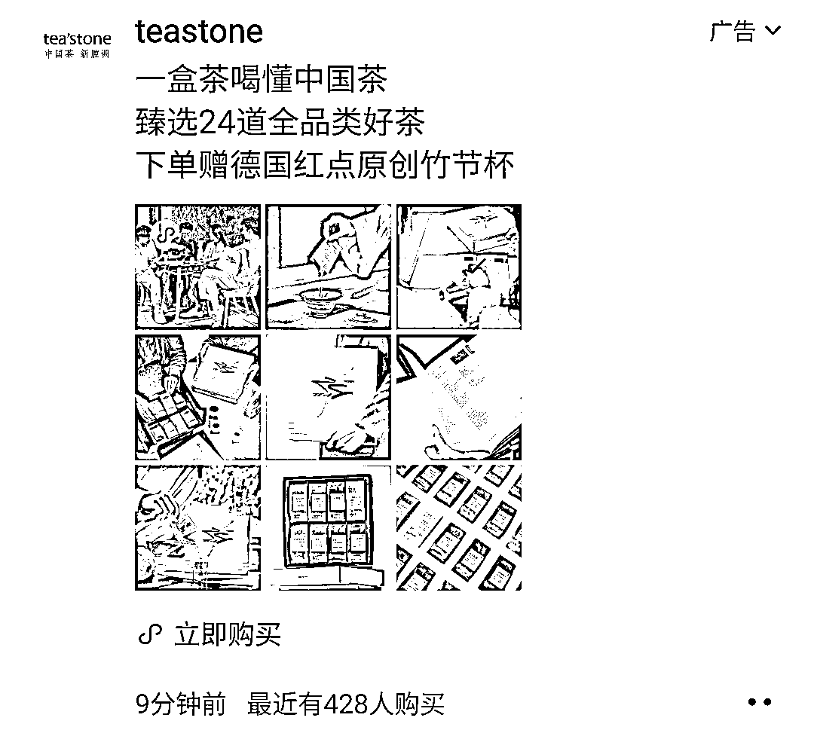

# Tea stone：场景创新+经营模式新型+中产阶级的嗨点+新媒体全域布局

> 原文：[`www.yuque.com/for_lazy/xkrm14/oe2npitkmyxculel`](https://www.yuque.com/for_lazy/xkrm14/oe2npitkmyxculel)

作者： 楚川

日期：2023-04-30

点赞数：39

<ne-hole id="u3de7ba8c" data-lake-id="u3de7ba8c"><ne-card data-card-name="hr" data-card-type="block" id="gTwXn" data-event-boundary="card">

正文：

Tea stone 是我每一场大会必夸的项目，场景创新+经营模式新型+中产阶级的嗨点+新媒体全域布局。 现在基本上类似的项目都是 1:1 复刻，也能看出创始人的厉害。说实话，去年我们也想做一个一模一样的，后面长沙疫情反复就让计划流产了，但是今年绝对有机会。 大家可以去观察类似的品牌，这个品牌就是:门店用好看的装修吸引人流，新媒体种草，私域流量进来有茶具和茶叶做复购。很多茶叶品牌在抖音的投入一个月可能就跟开一个这样的门店差不多，但是这种大店一个月至少沉淀 5000 以上的私域流量，性价比极高。

<ne-card data-card-name="image" data-card-type="inline" id="qY0aQ" data-event-boundary="card">  <ne-hole id="u8c30599e" data-lake-id="u8c30599e"><ne-card data-card-name="hr" data-card-type="block" id="WKbSP" data-event-boundary="card"><ne-p id="u757983ff" data-lake-id="u757983ff">评论区：

闲米 : 这不是小罐茶模式么

楚川 : 多去了解，不要轻易定义

<ne-hole id="u9a2c560a" data-lake-id="u9a2c560a"><ne-card data-card-name="hr" data-card-type="block" id="ogkv1" data-event-boundary="card">

公众号懒人找资源，懒人专属群分享

</ne-card></ne-hole></ne-card></ne-hole></ne-card></ne-p></ne-card></ne-hole>