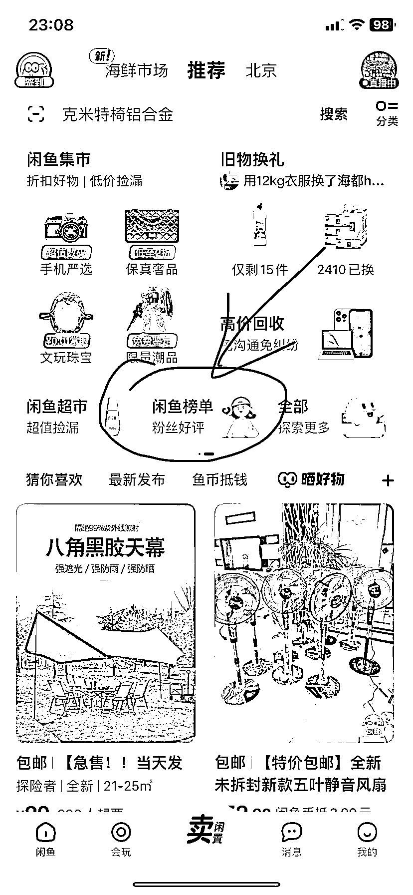
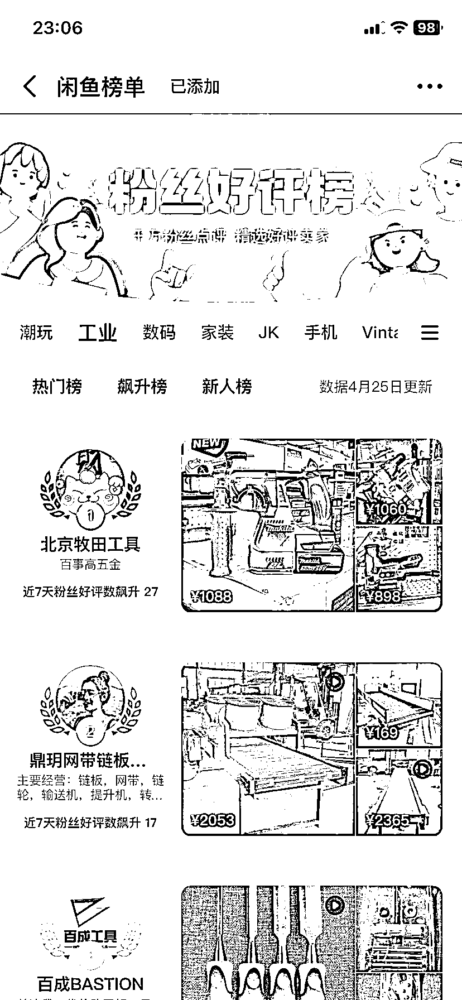
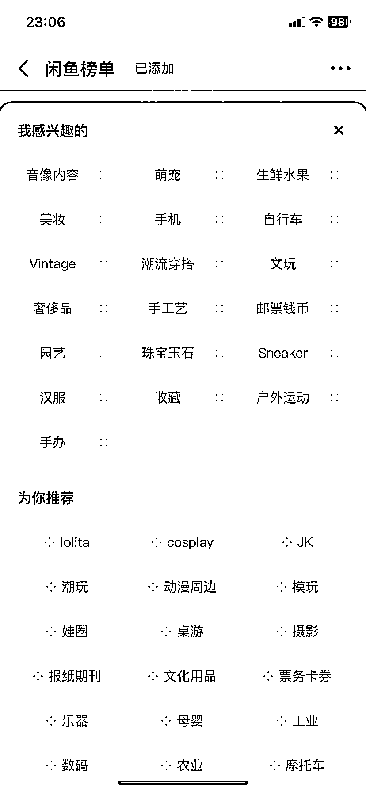
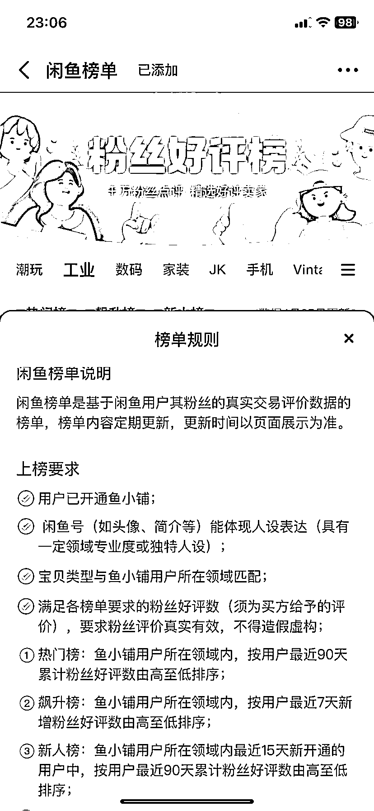
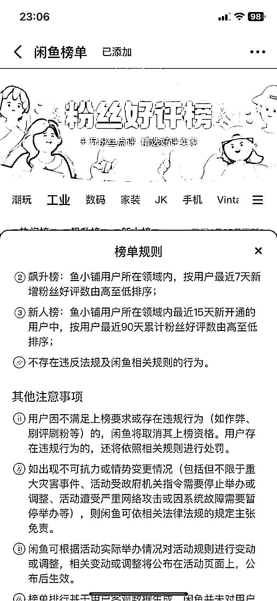

# 闲鱼榜单：一个非常好用的选品和找对标账号的工具

> 原文：[`www.yuque.com/for_lazy/xkrm14/ffk35cgyrlg015yh`](https://www.yuque.com/for_lazy/xkrm14/ffk35cgyrlg015yh)

<ne-text id="ucb382538">作者： 浮沉</ne-text>

<ne-text id="uc9d3f50d">日期：2023-04-30</ne-text>

<ne-text id="uada0f6ab">点赞数：</ne-text><ne-text id="u6612017e" ne-bold="true">105</ne-text>

<ne-hole id="u4afff773" data-lake-id="u4afff773"><ne-card data-card-name="hr" data-card-type="block" id="oF6UF" data-event-boundary="card">

<ne-text id="udda2d777">正文：</ne-text>

<ne-text id="ufc84bd75">闲鱼上有一个非常好用的选品和找对标账号的工具，那就是【闲鱼榜单】。</ne-text> <ne-text id="ue599e133">在闲鱼首页，找到闲鱼榜单，进去之后可以找对应的类目，比如音像制品，工业等，然后就可以看到对应的热门榜、飙升榜和新人榜，根据这些榜单就能看到你感兴趣的同行在卖什么产品，我想要和销售情况如何，再通过产品图片去其他平台比价，有利润空间即可上架，或者跟着对标账号去上架产品，简单、快捷、易上手。</ne-text> <ne-text id="u541c5e18">同时，你也可以根据榜单的规则，让自己快速上榜，拿到部分通过榜单查看的自然流量。</ne-text>

<ne-card data-card-name="image" data-card-type="inline" id="Y9GVS" data-event-boundary="card">  <ne-p id="u8f61afba" data-lake-id="u8f61afba"><ne-card data-card-name="image" data-card-type="inline" id="nXibc" data-event-boundary="card">  <ne-p id="ubee342f8" data-lake-id="ubee342f8"><ne-card data-card-name="image" data-card-type="inline" id="PFAb4" data-event-boundary="card">  <ne-p id="u992f9e32" data-lake-id="u992f9e32"><ne-card data-card-name="image" data-card-type="inline" id="Nw5SG" data-event-boundary="card">  <ne-p id="ub6eb3d05" data-lake-id="ub6eb3d05"><ne-card data-card-name="image" data-card-type="inline" id="h3hot" data-event-boundary="card">  <ne-p id="u8f27e928" data-lake-id="u8f27e928"><ne-card data-card-name="image" data-card-type="inline" id="fyIN4" data-event-boundary="card">  <ne-hole id="u52b76903" data-lake-id="u52b76903"><ne-card data-card-name="hr" data-card-type="block" id="nbqYu" data-event-boundary="card"><ne-p id="ua8094b01" data-lake-id="ua8094b01"><ne-text id="u7f216288">评论区：</ne-text>

<ne-text id="ud54ec4b0">渊 : 要开通鱼小铺才有吗</ne-text>

<ne-text id="u6176709a">浮沉 : 不需要也有，在首页导航上边左滑就能看到</ne-text>

<ne-text id="ua927c749">BetterMan : 请问一下，在没货源的情况下怎么上架呢？有没有操作经验。刚来剩菜的信任</ne-text>

<ne-text id="u0e0c45d9">浮沉 : 不需要货源，我们都是做无货源的买卖。阿里巴巴，淘宝，淘特，拼多多遍地都是货源，甚至闲鱼平台的商品就可以作为货源。</ne-text>

<ne-text id="ud6ece77b">述 : 有用[呲牙]</ne-text>

<ne-text id="uf364c9ad">愚蠢的大猩猩😎 : 请问可以加 v 详细跟您学习一下吗？</ne-text>

<ne-text id="u5fd7f1b0">浮沉 : 可以的，看我介绍里有。</ne-text>

<ne-text id="u8bdd75a5">阿凡达的忧伤 : 为啥我没有找到[捂脸][捂脸]</ne-text>

<ne-hole id="u127bade4" data-lake-id="u127bade4"><ne-card data-card-name="hr" data-card-type="block" id="suSbI" data-event-boundary="card">

<ne-text id="u96b8badc">公众号懒人找资源，懒人专属群分享</ne-text>

</ne-card></ne-hole></ne-card></ne-hole></ne-card></ne-p></ne-card></ne-p></ne-card></ne-p></ne-card></ne-p></ne-card></ne-p></ne-card></ne-p></ne-card></ne-hole>