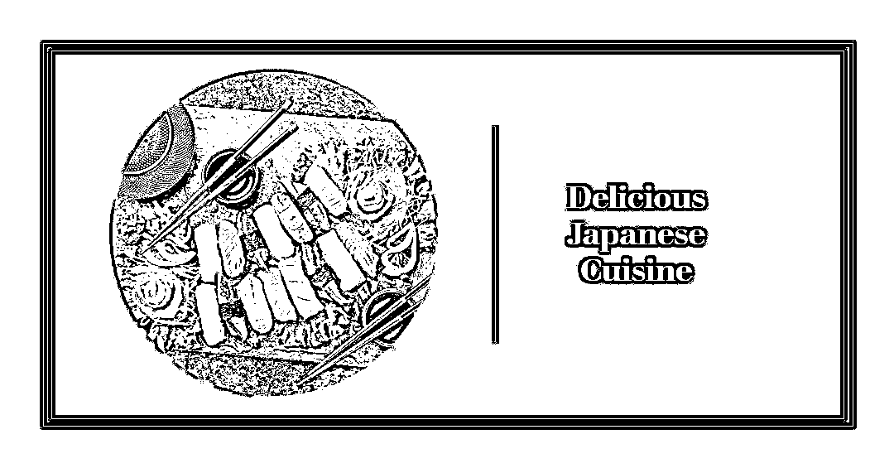
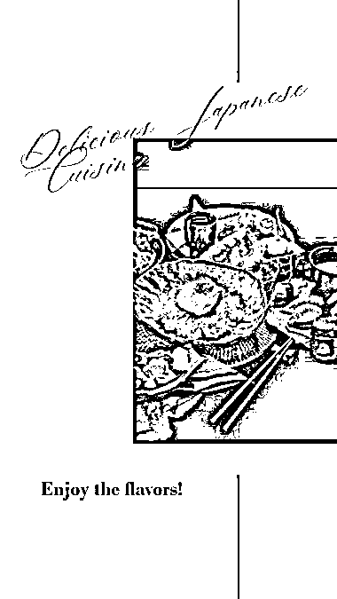

# 微软 Designer 重磅更新

> 原文：[`www.yuque.com/for_lazy/xkrm14/hogn51popr2c181g`](https://www.yuque.com/for_lazy/xkrm14/hogn51popr2c181g)

<ne-p id="u7851db27" data-lake-id="u7851db27"><ne-text id="u2b7567d8">作者： 修心阿</ne-text></ne-p> <ne-p id="ud3b95796" data-lake-id="ud3b95796"><ne-text id="u0a3f7a9e">日期：2023-04-30</ne-text></ne-p> <ne-p id="u6fc104c9" data-lake-id="u6fc104c9"><ne-text id="u1e31d913">点赞数：</ne-text><ne-text id="ubc5ad041" ne-bold="true">61</ne-text></ne-p> <ne-hole id="u733b7e9f" data-lake-id="u733b7e9f"><ne-card data-card-name="hr" data-card-type="block" id="BRNqK" data-event-boundary="card"><ne-p id="ud615aac0" data-lake-id="ud615aac0"><ne-text id="uced82e87">正文：</ne-text></ne-p> <ne-p id="uaabcae37" data-lake-id="uaabcae37"><ne-text id="ud44aecf6">微软 Designer 重磅更新 微软今天推出了他们 的最新更新，不需要 waitlist，直接体验：</ne-text> <ne-text id="ua3de17b3">我输入一段话：“美味的日料，请以此为主题设计一个小红书封面”。它直接给我出来 15 个设计初稿，各种图文视频混排。对没设计能力和审美的小白来说是个福音。各种作图省去了不少时间。或许也可以变现</ne-text>[<ne-text id="u2a099be7">http://designer.microsoft.com</ne-text>](http://designer.microsoft.com)</ne-p> <ne-p id="u709b35e9" data-lake-id="u709b35e9"><ne-card data-card-name="image" data-card-type="inline" id="WLqK6" data-event-boundary="card"></ne-card></ne-p> <ne-p id="u1fcdb803" data-lake-id="u1fcdb803"><ne-card data-card-name="image" data-card-type="inline" id="ybW1U" data-event-boundary="card"></ne-card></ne-p> <ne-p id="u97f51c93" data-lake-id="u97f51c93"><ne-card data-card-name="image" data-card-type="inline" id="TMo1b" data-event-boundary="card"></ne-card></ne-p> <ne-p id="u8cb81602" data-lake-id="u8cb81602"><ne-card data-card-name="image" data-card-type="inline" id="Guxha" data-event-boundary="card">  <ne-hole id="u964e0624" data-lake-id="u964e0624"><ne-card data-card-name="hr" data-card-type="block" id="CfkvJ" data-event-boundary="card"><ne-p id="uf07d33de" data-lake-id="uf07d33de"><ne-text id="u7ef6a5ba">评论区：</ne-text></ne-p> <ne-p id="uad87b788" data-lake-id="uad87b788"><ne-text id="u0c69d55b">陈雪娟 : 微软 Designer 重磅更新 微软今天推出了他们</ne-text> <ne-text id="u2b1efb0c">的最新更新，试过了，还不错</ne-text>[<ne-text id="u0b07710e">Microsoft+Designer+-+Stunning+designs+in+a+flash</ne-text>](http://designer.microsoft.com)</ne-p> <ne-p id="u373833dc" data-lake-id="u373833dc"><ne-text id="ub9a7e4ed">布衣 : 很早就拿到了白名单，当时试了下体验感不是太好，也有可能是使用方式不对</ne-text></ne-p> <ne-hole id="u153539f5" data-lake-id="u153539f5"><ne-card data-card-name="hr" data-card-type="block" id="XQItI" data-event-boundary="card"><ne-p id="u19475ca2" data-lake-id="u19475ca2"><ne-text id="ub85af416">公众号懒人找资源，懒人专属群分享</ne-text></ne-p></ne-card></ne-hole></ne-card></ne-hole></ne-card></ne-p></ne-card></ne-hole>