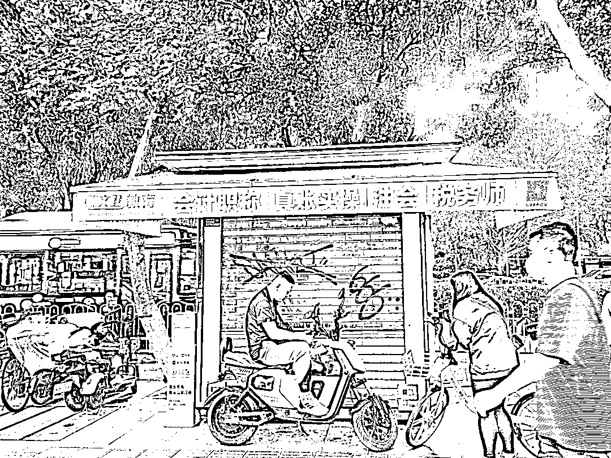

# 云连锁是一本万利的生意，最终还是要回归线下门店

> 原文：[`www.yuque.com/for_lazy/xkrm14/xl8q3rq15g0l64iz`](https://www.yuque.com/for_lazy/xkrm14/xl8q3rq15g0l64iz)

<ne-p id="uabf0acf5" data-lake-id="uabf0acf5"><ne-text id="u0c48bfbe">作者： 楚川</ne-text></ne-p> <ne-p id="u5428313a" data-lake-id="u5428313a"><ne-text id="ud1c24175">日期：2023-04-28</ne-text></ne-p> <ne-p id="u6e8ba35a" data-lake-id="u6e8ba35a"><ne-text id="uff8ce813">点赞数：</ne-text><ne-text id="u544fd7b6" ne-bold="true">23</ne-text></ne-p> <ne-hole id="u11c63e92" data-lake-id="u11c63e92"><ne-card data-card-name="hr" data-card-type="block" id="OsdZi" data-event-boundary="card"><ne-p id="u1ce43ae8" data-lake-id="u1ce43ae8"><ne-text id="u64cbe9bb">正文：</ne-text></ne-p> <ne-p id="uf8f72c59" data-lake-id="uf8f72c59"><ne-text id="uec624601">云连锁是一本万利的生意，但是在实体项目中赚钱，最终还是要回归线下门店。这就取决于 1 年内谁能做大量的抖音 poi 入驻，把门店成本压到最低，想想看一年一个档口 600 块，100 家店就是 6 万，但是你能做破亿的 gmv，这就是当下大部分人看不到的机会。同时极度便宜的门店展示也是一个很好的广告位，一石二鸟。最后想说的就是，有线下店才能避免平台的无休止稽查，懂的人自然懂。</ne-text></ne-p> <ne-p id="udaebb541" data-lake-id="udaebb541"><ne-card data-card-name="image" data-card-type="inline" id="gv2IF" data-event-boundary="card"></ne-card></ne-p> <ne-hole id="u2f0d12c5" data-lake-id="u2f0d12c5"><ne-card data-card-name="hr" data-card-type="block" id="IKLiO" data-event-boundary="card"><ne-p id="u195b5615" data-lake-id="u195b5615"><ne-text id="ua94947fe">评论区：</ne-text></ne-p> <ne-p id="u89a4f893" data-lake-id="u89a4f893"><ne-text id="u6652952a">九京 : 没看懂</ne-text></ne-p> <ne-p id="u1b7ac104" data-lake-id="u1b7ac104"><ne-text id="u08763c98">我亦飘零久🎈 : 平台会大打掉大批不合规的云连锁，然后自己出来做抖品牌连锁，现在已经在封店了</ne-text></ne-p> <ne-p id="u3e5398b6" data-lake-id="u3e5398b6"><ne-text id="uab879e38">楚川 : 所以要有实体店呀，我有招牌，有经营场所，凭啥封店</ne-text></ne-p> <ne-p id="ub81ca8c8" data-lake-id="ub81ca8c8"><ne-text id="u79f73219">曾崯晟 : 这不就是搞个喷绘挂在空门面吗？[惊讶]poi 要看营业执照，上面的地址匹配怎么解决？</ne-text></ne-p> <ne-p id="ub0d6a32b" data-lake-id="ub0d6a32b"><ne-text id="u4cc3563b">楚川 : 租用一个月也没多少</ne-text></ne-p> <ne-p id="u99a6cc8b" data-lake-id="u99a6cc8b"><ne-text id="ud52024d5">曾崯晟 : [强]就看谁能快速对接到上流的需求了</ne-text></ne-p> <ne-hole id="uea5e7643" data-lake-id="uea5e7643"><ne-card data-card-name="hr" data-card-type="block" id="VHVyx" data-event-boundary="card"><ne-p id="u669672ff" data-lake-id="u669672ff"><ne-text id="u66c1953e">公众号懒人找资源，懒人专属群分享</ne-text></ne-p></ne-card></ne-hole></ne-card></ne-hole></ne-card></ne-hole>