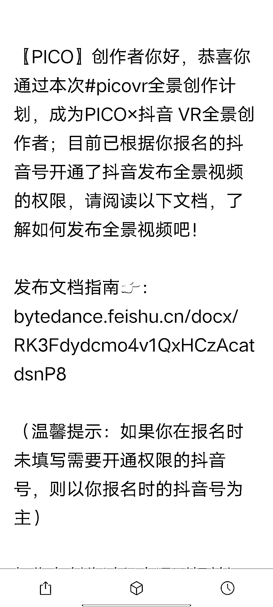

# 抖音可以发布全景视频，服务场景迎来升级

> 原文：[`www.yuque.com/for_lazy/xkrm14/xowim7yosiira7he`](https://www.yuque.com/for_lazy/xkrm14/xowim7yosiira7he)

作者： 酸橙

日期：2023-04-28

点赞数：36

<ne-hole id="u0b5ec8d1" data-lake-id="u0b5ec8d1">

正文：

抖音的全景视频开始了，试想下全景视频在场地为主要服务场景的探店，会不会是个大升级 附上发文指南:bytedance.feishu.cn/docx/RK3Fdydcmo4v1QxHCzAcatdsnP8

<ne-hole id="u90fd66a0" data-lake-id="u90fd66a0">

评论区：

熊自由 : 刷到过好几次全景。。没想到，又长认知了

明轩 : picovr.确实市场很大，未来可期，我买了一台体验很好

<ne-hole id="u50424d38" data-lake-id="u50424d38">

公众号懒人找资源，懒人专属群分享

</ne-hole></ne-hole></ne-hole>