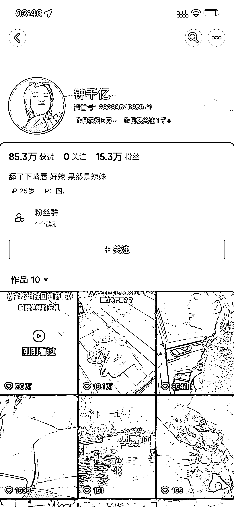
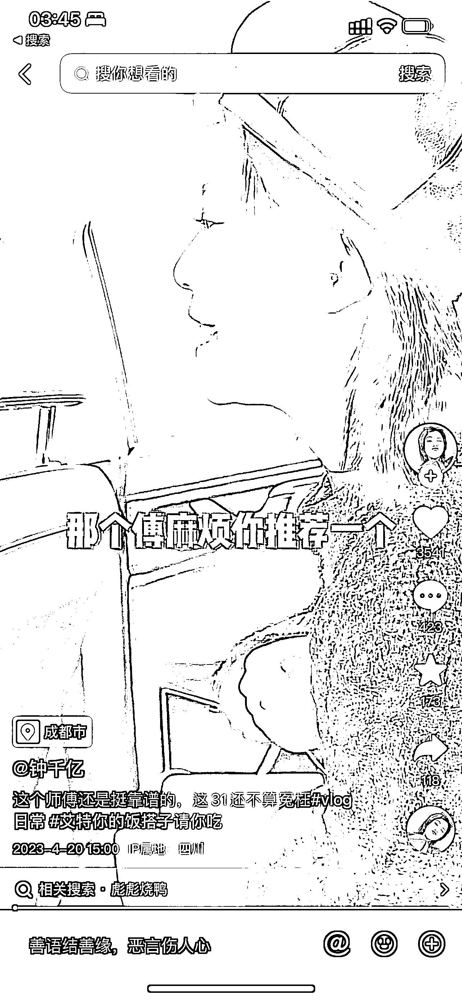

# 淄博市的大火的相应话题也能爆火，做本地生活相关的可以蹭一波流量

> 原文：[`www.yuque.com/for_lazy/xkrm14/xtciar0deznh5y66`](https://www.yuque.com/for_lazy/xkrm14/xtciar0deznh5y66)

<ne-text id="ub0507009">作者： 超</ne-text>

<ne-text id="u291ab02b">日期：2023-04-27</ne-text>

<ne-text id="u5803e3ba">点赞数：</ne-text><ne-text id="u97c3ea36" ne-bold="true">52</ne-text>

<ne-hole id="ucb041777" data-lake-id="ucb041777"><ne-card data-card-name="hr" data-card-type="block" id="X58mY" data-event-boundary="card">

<ne-text id="uae552aed">正文：</ne-text>

<ne-text id="ud6376f19">淄博市的大火相应话题的也是爆火，这个账号是我最近几天发现的，这个博主是成都这边的，通过两条拍摄"鬼称"视频而火，对比她之前的一些视频流量还是挺明显的，相信做本地生活相关的账号也可以通过拍摄当地的一些视频来蹭一波流量。</ne-text>

<ne-card data-card-name="image" data-card-type="inline" id="jnIh0" data-event-boundary="card"></ne-card>

<ne-card data-card-name="image" data-card-type="inline" id="bKSOw" data-event-boundary="card"></ne-card>

<ne-card data-card-name="image" data-card-type="inline" id="R2m4U" data-event-boundary="card"></ne-card>

<ne-card data-card-name="image" data-card-type="inline" id="qSxhd" data-event-boundary="card"></ne-card>

<ne-hole id="u92fb3814" data-lake-id="u92fb3814"><ne-card data-card-name="hr" data-card-type="block" id="qC8WX" data-event-boundary="card">

<ne-text id="uac7da215">评论区：</ne-text>

<ne-hole id="u9ca5f108" data-lake-id="u9ca5f108"><ne-card data-card-name="hr" data-card-type="block" id="NXW8c" data-event-boundary="card">

<ne-text id="u34cbcd23">公众号懒人找资源，懒人专属群分享</ne-text>

</ne-card></ne-hole></ne-card></ne-hole></ne-card></ne-hole>