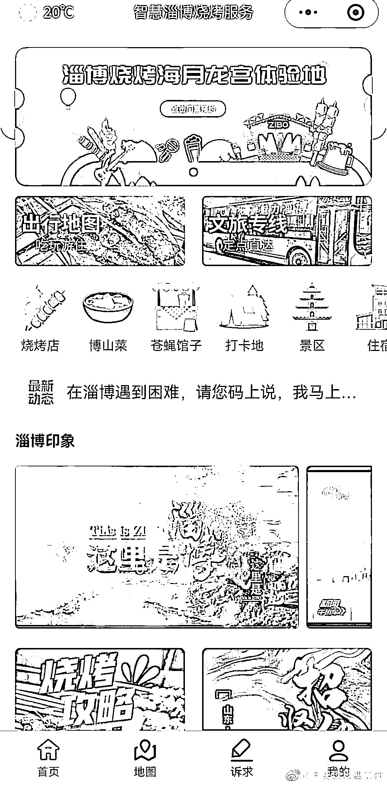
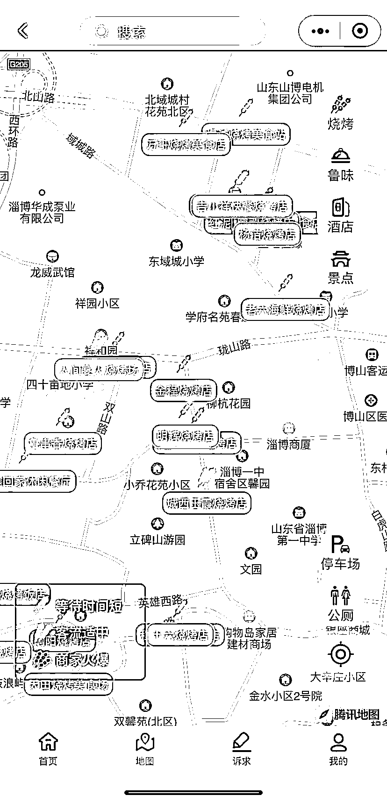

# 淄博上线智慧淄博烧烤服务小程序，将传统的烧烤店与智能化巧妙结合

> 原文：[`www.yuque.com/for_lazy/xkrm14/ofcx835ospv9qguw`](https://www.yuque.com/for_lazy/xkrm14/ofcx835ospv9qguw)

<ne-text id="uc011fd10">作者： 瞳朦</ne-text>

<ne-text id="u00596869">日期：2023-04-26</ne-text>

<ne-text id="uecc89a9c">点赞数：</ne-text><ne-text id="ub8139555" ne-bold="true">46</ne-text>

<ne-hole id="u5e8fcc33" data-lake-id="u5e8fcc33"><ne-card data-card-name="hr" data-card-type="block" id="nlBqD" data-event-boundary="card">

<ne-text id="u53667a39">正文：</ne-text>

<ne-text id="u4ed0bf7a">淄博上线，智慧淄博烧烤服务小程序，这个创新的商业模式，极大地降低人工成本，将传统的烧烤店与智能化巧妙结合。</ne-text> <ne-text id="u099f188c">通过互联网+等方式，吸引更多年轻消费者，增加了品牌影响力和市场份额，智能化点餐、支付、娱乐、住宿、景区等多种功能，提升了消费者的体验，提供了便利性。</ne-text> <ne-text id="ucbae09a7">小程序的地图中可以查看各个烧烤店的客流量情况，帮助游客寻找合适的餐饮店，另外还上线了诉求板块，在客户的角度，提供了更好的服务，极大的增加了顾客满意度。</ne-text> <ne-text id="ubf835230">智慧淄博烧烤服务这个新的商业模式，有很大的发展潜力和收益空间。</ne-text>

<ne-card data-card-name="image" data-card-type="inline" id="MRdh2" data-event-boundary="card"></ne-card>

<ne-card data-card-name="image" data-card-type="inline" id="fFLbB" data-event-boundary="card">  <ne-hole id="u3f61e807" data-lake-id="u3f61e807"><ne-card data-card-name="hr" data-card-type="block" id="XYkU7" data-event-boundary="card"><ne-p id="u2347c6b3" data-lake-id="u2347c6b3"><ne-text id="u80a55f91">评论区：</ne-text>

<ne-text id="u6998c90c">瞳朦 : 感谢[太阳]</ne-text>

<ne-hole id="ubc93be5e" data-lake-id="ubc93be5e"><ne-card data-card-name="hr" data-card-type="block" id="S9DTE" data-event-boundary="card">

<ne-text id="u223a9ad4">公众号懒人找资源，懒人专属群分享</ne-text>

</ne-card></ne-hole></ne-card></ne-hole></ne-card></ne-p></ne-card></ne-hole>