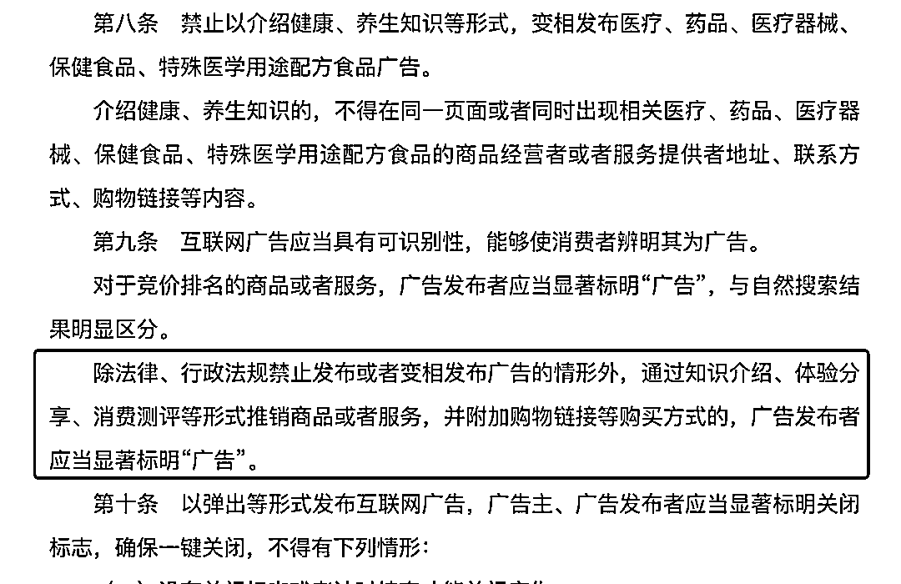

# 新版《互联网广告管理办法》将在 5.1 后开始实施

> 原文：[`www.yuque.com/for_lazy/xkrm14/xs5rglkmi9as07t2`](https://www.yuque.com/for_lazy/xkrm14/xs5rglkmi9as07t2)

<ne-p id="u04218b93" data-lake-id="u04218b93"><ne-text id="u9d426945">作者： 大龙</ne-text></ne-p> <ne-p id="u6432430b" data-lake-id="u6432430b"><ne-text id="uaf81789d">日期：2023-04-26</ne-text></ne-p> <ne-p id="ufa9b7195" data-lake-id="ufa9b7195"><ne-text id="ue0b33956">点赞数：</ne-text><ne-text id="uef6b8c70" ne-bold="true">29</ne-text></ne-p> <ne-hole id="u9bc94522" data-lake-id="u9bc94522"><ne-card data-card-name="hr" data-card-type="block" id="zid4G" data-event-boundary="card"><ne-p id="u9539bbc7" data-lake-id="u9539bbc7"><ne-text id="ud6491cd7">正文：</ne-text></ne-p> <ne-p id="ud92e0933" data-lake-id="ud92e0933"><ne-text id="uba1d6f24">新版《互联网广告管理办法》将在 5.1 后开始实施，新法规定内容带货就是广告。</ne-text> <ne-text id="u1ab54311">《通过知识介绍、体验分享、消费测评等形式推销商品或者服务，并附加购物链接等购买方式的，广告发布者应当显著标明“广告”。》</ne-text> <ne-text id="u42d2a0a8">新法实施后上海市监局准备抓典型。目前小红书抖音快手百度都在开发系统，准备随时打广告标。 1 首先针对的是内容带货；</ne-text> <ne-text id="ub2bb115d">2 非带货种草是其次，如果监管严格的话也需要打标； 3 非商单不需要打标。 现在各大平台都在储备打标能力，种草内容暂时不上线打标，一旦监管抓紧，立马上系统。</ne-text> <ne-text id="u53ef7efb">新广告法</ne-text>[<ne-text id="ue8cdfa1d">互联网广告管理办法</ne-text>](https://gkml.samr.gov.cn/nsjg/fgs/202303/t20230320_353974.html)</ne-p> <ne-p id="u178216cb" data-lake-id="u178216cb"><ne-card data-card-name="image" data-card-type="inline" id="UtJKh" data-event-boundary="card"></ne-card></ne-p> <ne-hole id="u2077eb26" data-lake-id="u2077eb26"><ne-card data-card-name="hr" data-card-type="block" id="x35WE" data-event-boundary="card"><ne-p id="uf661e098" data-lake-id="uf661e098"><ne-text id="u636a91ea">评论区：</ne-text></ne-p> <ne-hole id="ub8319d98" data-lake-id="ub8319d98"><ne-card data-card-name="hr" data-card-type="block" id="hqtsS" data-event-boundary="card"><ne-p id="u372ea8fe" data-lake-id="u372ea8fe"><ne-text id="u1064d898">公众号懒人找资源，懒人专属群分享</ne-text></ne-p></ne-card></ne-hole></ne-card></ne-hole></ne-card></ne-hole>