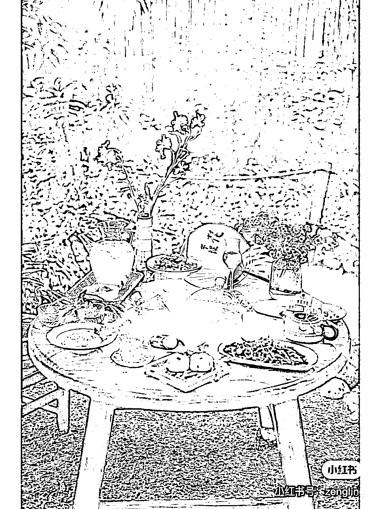

# 围炉煮茶之后是围炉冰茶么

> 原文：[`www.yuque.com/for_lazy/xkrm14/micrawvedifn2wsm`](https://www.yuque.com/for_lazy/xkrm14/micrawvedifn2wsm)

作者： 嘉育

日期：2023-04-25

点赞数：33

<ne-hole id="uec40081d" data-lake-id="uec40081d"><ne-card data-card-name="hr" data-card-type="block" id="TCKOC" data-event-boundary="card">

正文：

围炉煮茶之后是围炉冰茶么[偷笑] 小红书上搜了搜，很多城市都有 xx 围炉冰茶第一家。 其实也就是用干冰搞个氛围，配上古色古香的容器，放中式点心西式点心的都有，看图片在干冰消散前非常适合拍照。 不过也有人说干冰使用的安全性等等，可能比煮茶更麻烦一点点~

<ne-card data-card-name="image" data-card-type="inline" id="LZUyc" data-event-boundary="card"></ne-card>

<ne-card data-card-name="image" data-card-type="inline" id="vNVjC" data-event-boundary="card"></ne-card>

<ne-card data-card-name="image" data-card-type="inline" id="EqudR" data-event-boundary="card"></ne-card>

<ne-hole id="u87f2eab9" data-lake-id="u87f2eab9"><ne-card data-card-name="hr" data-card-type="block" id="SIFOM" data-event-boundary="card">

评论区：

飞向云端 : 夏天应该有市场[呲牙][呲牙]

洋葱 : 这个不错

<ne-hole id="u7f4e7937" data-lake-id="u7f4e7937"><ne-card data-card-name="hr" data-card-type="block" id="N1mr8" data-event-boundary="card">

公众号懒人找资源，懒人专属群分享

</ne-card></ne-hole></ne-card></ne-hole></ne-card></ne-hole>