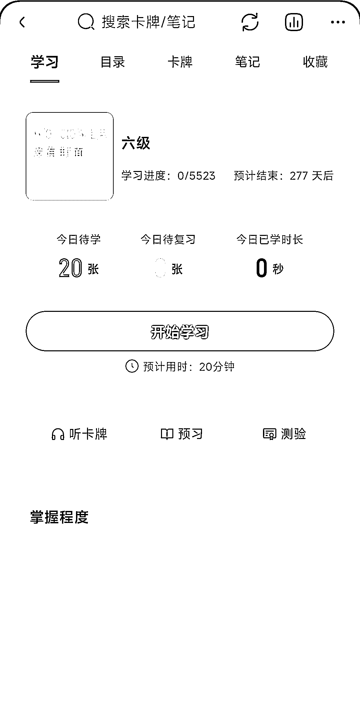
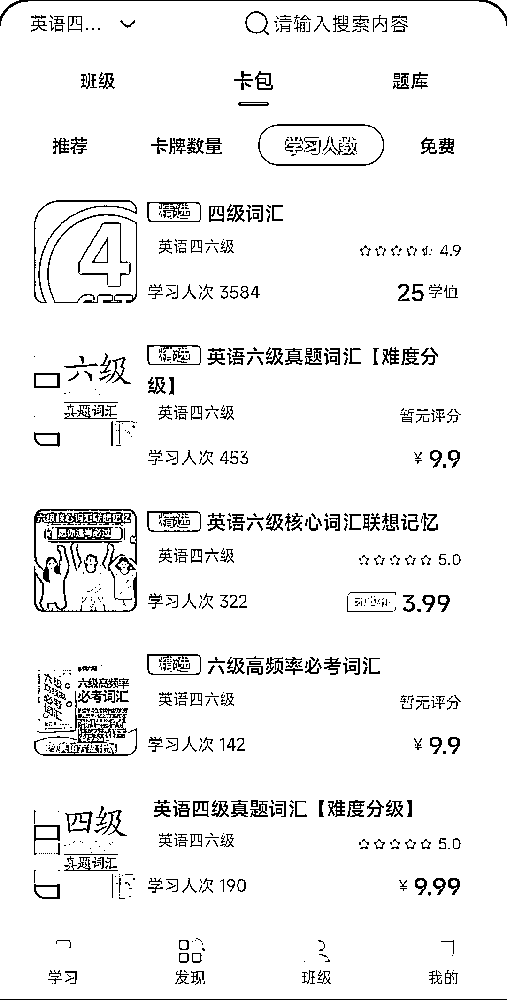
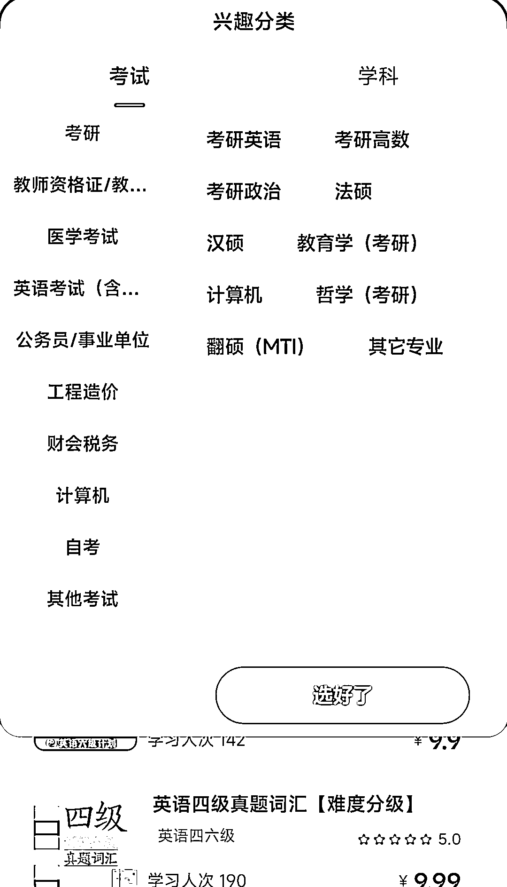

# Anki 笔记有很大的市场

> 原文：[`www.yuque.com/for_lazy/xkrm14/rdtnlbl1rg9dgn6n`](https://www.yuque.com/for_lazy/xkrm14/rdtnlbl1rg9dgn6n)

<ne-text id="ucc56829e">作者： 幻景</ne-text>

<ne-text id="ue3bc5ecb">日期：2023-04-25</ne-text>

<ne-text id="u3a63df35">点赞数：</ne-text><ne-text id="uff82cb2c" ne-bold="true">28</ne-text>

<ne-hole id="u91ecbedd" data-lake-id="u91ecbedd"><ne-card data-card-name="hr" data-card-type="block" id="G04Hn" data-event-boundary="card">

<ne-text id="uff555835">正文：</ne-text>

<ne-text id="uc113794a">Anki 笔记自从出现之后就很受大家关注。而自己制作的话，会花费非常大的人力物力，有现成的花点钱直接购买就很方便。 现在考研、考公、英语四六级、高考</ne-text> <ne-text id="u4d53c68b">等各种考试的群体非常大。所以，Anki 笔记有很大的市场。 可以在淘宝、公众号、专门的 Anki 软件</ne-text> <ne-text id="ub1c92cf7">等地方出售，可以拉私域再做其他转化。还可以给用户定做 Anki 卡片。</ne-text>

<ne-card data-card-name="image" data-card-type="inline" id="Xzwyx" data-event-boundary="card"></ne-card>

<ne-card data-card-name="image" data-card-type="inline" id="hXEw3" data-event-boundary="card"></ne-card>

<ne-card data-card-name="image" data-card-type="inline" id="FLHo8" data-event-boundary="card"></ne-card>

<ne-card data-card-name="image" data-card-type="inline" id="mrTU6" data-event-boundary="card"></ne-card>

<ne-card data-card-name="image" data-card-type="inline" id="JvR96" data-event-boundary="card"></ne-card>

<ne-card data-card-name="image" data-card-type="inline" id="ZONEZ" data-event-boundary="card"></ne-card>

<ne-hole id="uc1cde650" data-lake-id="uc1cde650"><ne-card data-card-name="hr" data-card-type="block" id="NkmUn" data-event-boundary="card">

<ne-text id="u4dfafe2c">评论区：</ne-text>

<ne-hole id="u94310831" data-lake-id="u94310831"><ne-card data-card-name="hr" data-card-type="block" id="gylmc" data-event-boundary="card">

<ne-text id="u6986aa03">公众号懒人找资源，懒人专属群分享</ne-text>

</ne-card></ne-hole></ne-card></ne-hole></ne-card></ne-hole>