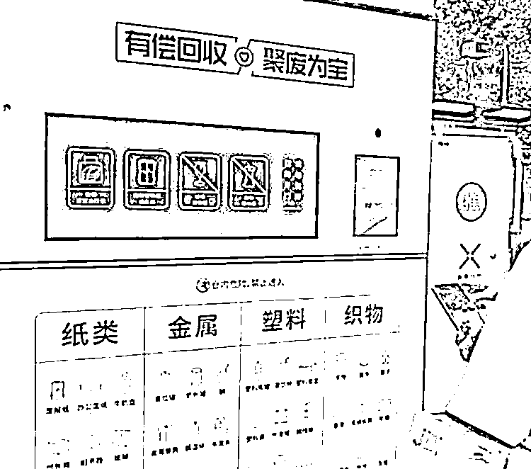

# 小区内的自助回收机器很火爆

> 原文：[`www.yuque.com/for_lazy/xkrm14/zoue2bx1l7hbeaxi`](https://www.yuque.com/for_lazy/xkrm14/zoue2bx1l7hbeaxi)

作者： Mr.Rabbit

日期：2023-05-03

点赞数：50

<ne-hole id="ud3e87b1f" data-lake-id="ud3e87b1f"><ne-card data-card-name="hr" data-card-type="block" id="dDwW1" data-event-boundary="card">

正文：

小区内的自助回收机器很火爆。 可以通过手机小程序查看可投放空间，有时候机器旁边还有人教大家怎么使用。满 10 元后，可以通过小程序提现。

<ne-card data-card-name="image" data-card-type="inline" id="cLRIr" data-event-boundary="card">  <ne-hole id="uf4ed546c" data-lake-id="uf4ed546c"><ne-card data-card-name="hr" data-card-type="block" id="xzsXb" data-event-boundary="card"><ne-p id="u469d2d02" data-lake-id="u469d2d02">评论区：

水木目 : 现在学校也有了

<ne-hole id="udfe52aa5" data-lake-id="udfe52aa5"><ne-card data-card-name="hr" data-card-type="block" id="Di8Jz" data-event-boundary="card">

公众号懒人找资源，懒人专属群分享

</ne-card></ne-hole></ne-card></ne-hole></ne-card></ne-p></ne-card></ne-hole>