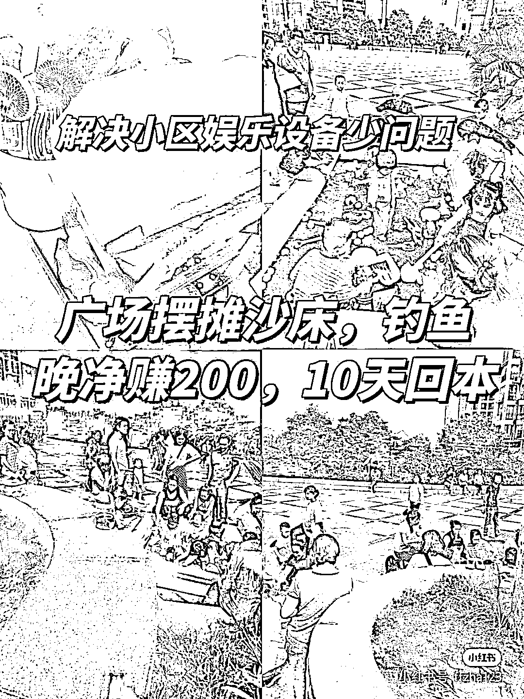

# 广场摆摊沙床和钓鱼，一晚上净赚 200，10 天快速回本

> 原文：[`www.yuque.com/for_lazy/xkrm14/qpc0uku31uvxndow`](https://www.yuque.com/for_lazy/xkrm14/qpc0uku31uvxndow)

<ne-p id="u896f7d42" data-lake-id="u896f7d42"><ne-text id="u9d77f1a1">作者： 坏脾气的小可爱</ne-text></ne-p> <ne-p id="u6b545e05" data-lake-id="u6b545e05"><ne-text id="u68c4aa2f">日期：2023-04-25</ne-text></ne-p> <ne-p id="uff2536ba" data-lake-id="uff2536ba"><ne-text id="u63be0aeb">点赞数：</ne-text><ne-text id="u1ca14faf" ne-bold="true">47</ne-text></ne-p> <ne-hole id="u499989f6" data-lake-id="u499989f6"><ne-card data-card-name="hr" data-card-type="block" id="oU4rk" data-event-boundary="card"><ne-p id="uce520b7f" data-lake-id="uce520b7f"><ne-text id="u1c452011">正文：</ne-text></ne-p> <ne-p id="u4440628a" data-lake-id="u4440628a"><ne-text id="u40e72fcf">广场摆摊沙床，钓鱼一晚上净赚 200，10 天快速回本。 靠谱群里刚刚看到有个小伙伴分享这张图，立马就想到很多玩法。</ne-text> <ne-text id="u083856f9">夏天的时候，可以小区或者公园，广场摆的充气沙床和充气钓鱼。这种没有除了买道具的成本以外没有任何成本。</ne-text> <ne-text id="ub14022df">自己一晚上守着那让小孩子玩，一个小孩子 20 块钱，一晚上能赚不少钱。 附加变现方法：</ne-text> <ne-text id="u9df5d261">1、你钓鱼里面可以弄点真的小金鱼，然后如果他钓不到，你还可以卖，这种成本很低。 2、你可以旁边再卖点玩具，小孩子都喜欢玩具。</ne-text> <ne-text id="uff87cccf">3、旁边你还可以搞个弄石膏画像的摊子，搞一些哆啦 a 梦，奥特曼，等比较出名的动漫那种。一个可以收 15 或者具体多少根据你们那消费定。</ne-text> <ne-text id="u61be55e8">4、你还可以让她们扫你二维码，转发朋友圈，达到多少赞给你抵扣多少钱，让更多的人来。</ne-text> <ne-text id="u2ea8f0a8">具体就先分享这么多玩法呀。想知道更多玩法等小可爱再分享呀欢迎大家交流分享更多玩法，思维碰撞。</ne-text></ne-p> <ne-p id="u38765bfc" data-lake-id="u38765bfc"><ne-card data-card-name="image" data-card-type="inline" id="yJYXR" data-event-boundary="card"></ne-card></ne-p> <ne-hole id="ua9e68066" data-lake-id="ua9e68066"><ne-card data-card-name="hr" data-card-type="block" id="cxukk" data-event-boundary="card"><ne-p id="ud1f271f0" data-lake-id="ud1f271f0"><ne-text id="u797408e3">评论区：</ne-text></ne-p> <ne-p id="u7a3d4462" data-lake-id="u7a3d4462"><ne-text id="u07583014">飞鸡壳壳 : 摆摊的就是我啦～夏天到了，这个实操可以做起来～</ne-text></ne-p> <ne-p id="u4c3c7f61" data-lake-id="u4c3c7f61"><ne-text id="u03ba35eb">坏脾气的小可爱 : 摆摆摆，等你赚钱群里告诉我，让我也跟着你一起乐。感谢分享的素材！</ne-text></ne-p> <ne-p id="u761a9bca" data-lake-id="u761a9bca"><ne-text id="u61729b66">惠玲 : 来了！！优秀！！</ne-text></ne-p> <ne-p id="u7d103070" data-lake-id="u7d103070"><ne-text id="u69b16cb8">momo : 城管抓不😂</ne-text></ne-p> <ne-p id="u81386459" data-lake-id="u81386459"><ne-text id="u5d26f059">坏脾气的小可爱 : 你得找那种就是有的，可以需要摊位费，或者说那种允许摆摊的地方。有的地方是他可以允许你摆摊的，那种就没事，你不要去找那种不能摆摊的地方。</ne-text></ne-p> <ne-p id="u0d13e828" data-lake-id="u0d13e828"><ne-text id="uf921a8f1">坏脾气的小可爱 : 嘻嘻！</ne-text></ne-p> <ne-hole id="u4ba70d9b" data-lake-id="u4ba70d9b"><ne-card data-card-name="hr" data-card-type="block" id="SSnnS" data-event-boundary="card"><ne-p id="u167758c4" data-lake-id="u167758c4"><ne-text id="u3700855c">公众号懒人找资源，懒人专属群分享</ne-text></ne-p></ne-card></ne-hole></ne-card></ne-hole></ne-card></ne-hole>