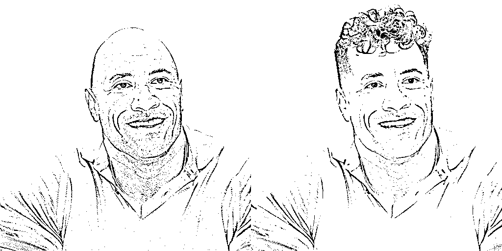
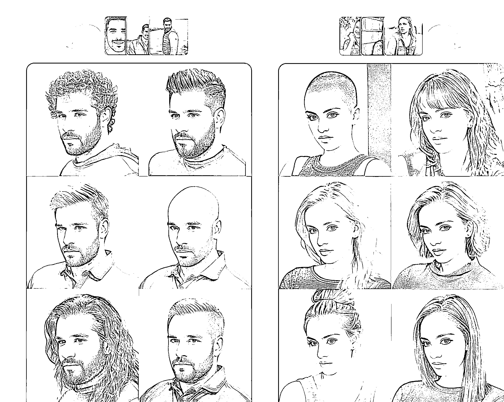

# BarberGPT：眨眼间改变发型，保护用户隐私的个人 AI 理发师网站

> 原文：[`www.yuque.com/for_lazy/xkrm14/flyokf6llrw5gv31`](https://www.yuque.com/for_lazy/xkrm14/flyokf6llrw5gv31)

作者： 涵哥

日期：2023-06-19

点赞数：124

正文：

BarberGPT 是一个个人 AI 理发师网站，用户可以上传自己的照片，突出自己的头发，然后看到一个惊人的变化。这个网站提供了无限的可能性，用户可以在眨眼之间改变自己的发型。此外，这个网站非常注重用户的隐私，他们会保护用户的图片。这个网站非常用户友好，用户只需要几次点击就可以体验到理发师的感觉。虽然网站没有明确列出他们提供的发型种类，但他们在常见问题解答部分提到了可能会有费用。此外，BarberGPT 鼓励用户在社交媒体上分享他们的新发型。 体验网址： HairstyleAI 是一个虚拟的 AI 发型试穿网站，适用于男性和女性。用户可以在剪发之前虚拟尝试新的发型，从而对自己的外观更有信心。这个网站已经帮助成千上万的人使用他们的摄影工具创建了自己的照片。用户可以选择 30 种独特的发型，每种发型有 4 种不同的姿势，总共可以得到 120 张高清照片，只需要支付 9 美元的一次性费用。用户上传自己的自拍照，然后 AI 摄影师会生成发型，用户可以下载自己喜欢的发型。此外，HairstyleAI 在常见问题解答部分解答了关于用户数据存储和图片所有权的问题。 体验网址： [BarberGPT](https://www.barbergpt.ai/) [HairstyleAIVirtualAIHairstyleTryOnforMaleandFemale](https://www.hairstyleai.com/)

  

  

  

评论区：

阿黎 : 这个很适合去小红书引流，收费做设计啊

涵哥 : 搞起来

铁酱酱 : 第一个我试了，只能免费使用六次，六次后也没有显示充值付费渠道。 第二个还没付费，看了下，应该是属于私人订制，就是你上传一组照片出 120 张图，如果再上传别人的话照片应该不行。 所以给别人做设计的想法有点行不通

涵哥 : 再等一等～

谬误剑士 : 谢谢提醒～

云清 : 感谢这个补课

云清 : 优秀啊

