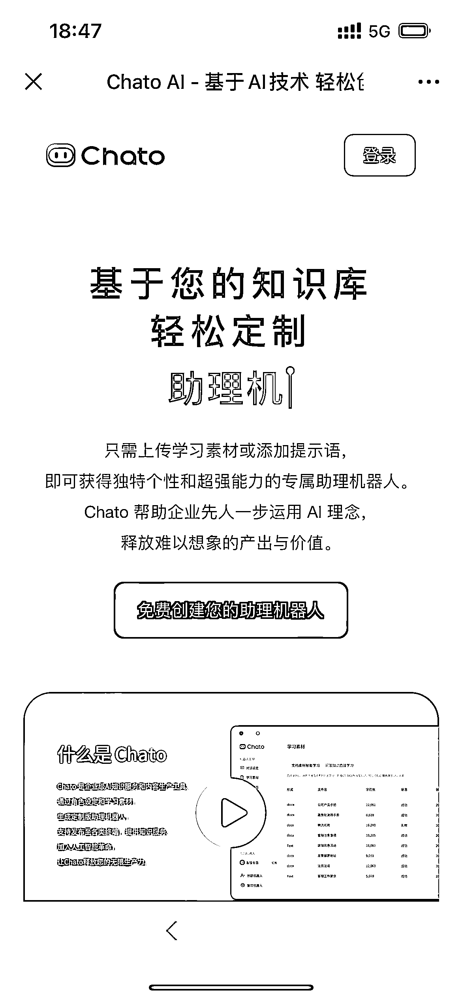
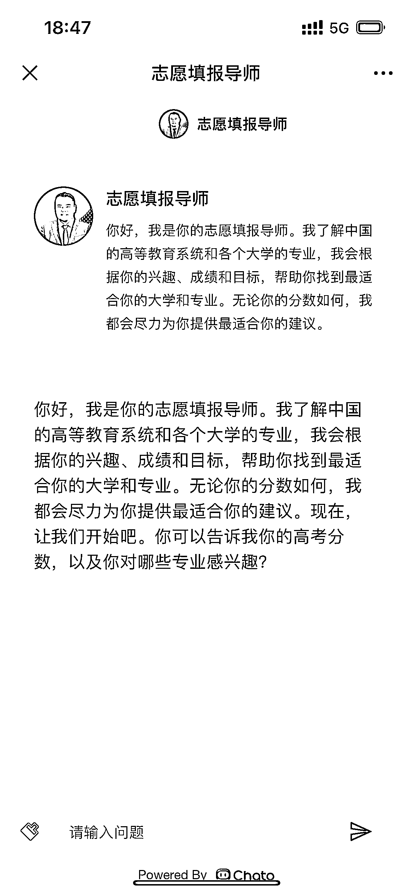

# 高考填报志愿的 AI 服务：Chato 帮你轻松解决问题

> 原文：[`www.yuque.com/for_lazy/xkrm14/wgxt8qcyq15kl88z`](https://www.yuque.com/for_lazy/xkrm14/wgxt8qcyq15kl88z)

作者： 金九渊

日期：2023-06-21

点赞数：62

正文：

用类似 chatdoc、chatpdf 或者 Chato-基于 AI 技术轻松创建对话机器人尝试做个“高考填报志愿的 AI”服务。 逻辑很简单: 1、你随便去淘宝或者各种资料站搜集下张雪峰等人关于专业、院校、城市等高考填报志愿的文档; 2、把文档给到 chato，变成基于自然语言的对话交流-- 淘宝上虽然 2.9 元就能买到 100 多 G 资料，但是学生基本不会看的。 3、你把文档给到系统，前端封装成专门高考填报辅助 AI，然后测试下。 机器人助理创建网址 体验用： [Chato-基于 AI 技术轻松创建对话机器人](https://chato.cn/) [Chato-基于 AI 技术轻松创建对话机器人](https://chato.cn/b/zk34lrl1ok59xnjd)

评论区：

谭不惑 : 测试了下 670 让我去上清华[呲牙]

胖大魔 : 秀儿！

张热烈啊 : 不太行

倪大胖 : 请问 chato 是 3.5 还是 4.0

金九渊 : 3.5

伟业 : 说实话，最终的效果不太行，无法替代人工。

