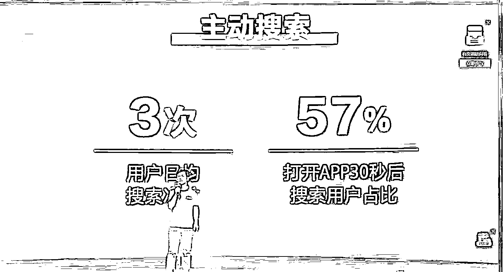

# 抖音改变 slogan，重点打造行业关键词，从 SEO 中增长获客份额

> 原文：[`www.yuque.com/for_lazy/xkrm14/zvxigdd1939w7roa`](https://www.yuque.com/for_lazy/xkrm14/zvxigdd1939w7roa)

作者： 阿 may

日期：2023-06-21

点赞数：54

正文：

抖音已改 slogan，改为“搜好出‬生活，搜‬出新生意” 抖音今年官‬宣加大搜索市场份额，各行各业都应该重点布局搜索赛道，今年做抖音一定要重点打造自己的行业关键词，从 seo 中增长获客份额

  

  

  

评论区：

阿 may : 抖音估计会跟百度一样，推出竞价排名策略

Mr.汉松 : 抖音搜索是一个还未过度开发的资源

胖大魔 : 感觉相互侵占市场

野鸭冲锋队 : 抖音 SEO 工具大有可为

