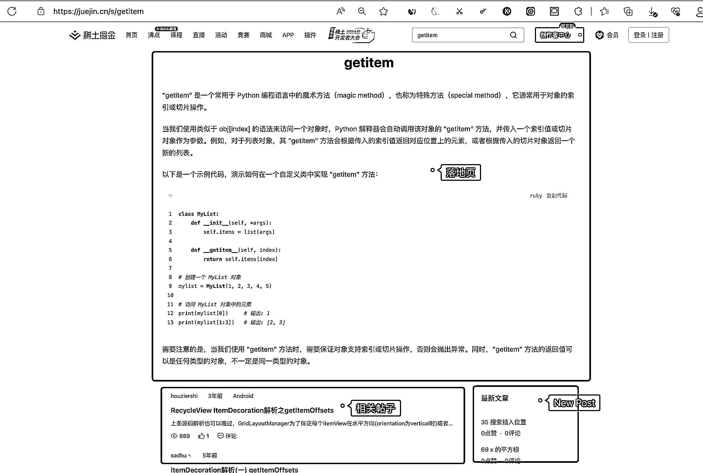

# 掘金网通过 SEO 增长，谷歌收录了 2590 万个搜索结果页

> 原文：[`www.yuque.com/for_lazy/xkrm14/hsfgh9qgpqxdhh7z`](https://www.yuque.com/for_lazy/xkrm14/hsfgh9qgpqxdhh7z)

作者： 三林

日期：2023-06-21

点赞数：57

正文：

技术网站「掘金」的 SEO 增长密码，谷歌收录了其 2590 万个搜索结果页，占了 2590 万个关键词的长尾流量，比如这样的搜索结果页 有趣的是：这样的落地页只能在搜索来哦，在网站正常访问时是看不到这个网页的。 该落地页的结构如下图，关键词介绍信息为落地页主体，顶部导航和下方的相关文章可以作为下游点击。 掘金官网的访客，搜索流量占比 65.65% ，上月超过了 1000 万访客来自搜索引擎，我想上面的静态搜索结果页的铺量起到了不小的作用的。进一步你可以再通过工具查到搜索流量中，谷歌占比多少，百度占比多少 。 这个方式，以掘金的案例来说，在谷歌上生效了，在百度上还没起到作用。 juejin.cn 整站： 谷歌的总收录数 45,600,000 条； 百度的总收录数 7,630,000 条； 但我也想够了，开发工程师、程序员群体为主的掘金网用谷歌的用户群也并非少数。 生财之前有一篇精华帖，讲钉钉通过搜索结果页做的聚合长尾流量，也是一个成功案例。具体传送门 而这样的案例还有，比如 阿里云、腾讯云 都实践并拿到好的结果，概莫如此。[getitem-掘金](https://juejin.cn/s/getitem) [简析 SEO 聚合玩法 3 个月内从权 3 到权重 7 钉钉是如何做的](https://t.zsxq.com/0fUSP0dRD)

  

评论区：

三林 : 哈哈，GitHub 也干了 site:github.com/topics

野鸭冲锋队 : 卧槽，通过你这个传送门才知道，国平老师也是生财圈的？

三林 : 国平老师是生财有术的嘉宾呀，你看圈子里的嘉宾列表

