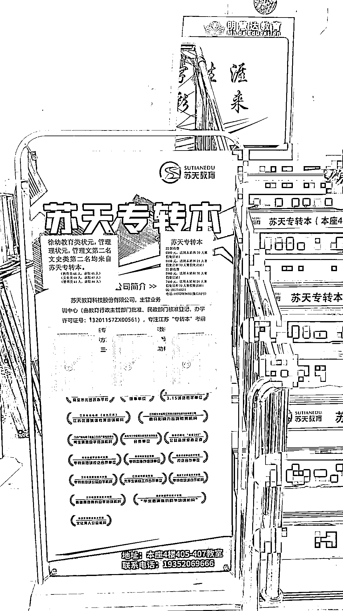

# 大专院校打印店成功代理专科转本科课程，百万级别营收的创业机会

> 原文：[`www.yuque.com/for_lazy/xkrm14/fgmgzwaspf2c1zd1`](https://www.yuque.com/for_lazy/xkrm14/fgmgzwaspf2c1zd1)

作者： 七对

日期：2023-06-23

点赞数：71

正文：

有个小兄弟在一所大专院校开了个打印店，平时给学生提供便宜的打印，同时服务好学生，加微信维护～ 同时他更主要的是代理了专科转本科的课程～代理卖课才是主业 这里有几个关键点 1、打印只是入口，引流 2、变现是专科转本科的考试培训，全日制大专生在大三的一年是可以参加考试，重新填报志愿，上全日制本科的，本省的本科～江苏这边我比较清楚～关键这个考试的参培率非常高，宿舍，同学，班级一起的比较多 3、代理的课程比较靠谱，跟老牌机构合作的，教学口碑，质量不用担心，当然好的代理不是轻易能拿到 4、代理的课程的佣金空间比较大，而自己的成本不高 5、做好学生的维护，平时多聊，转介绍等，粘度～ 按照一年招 500 个学生，一个学生的佣金在小几千，就有百万级别的营收了～成本又不大～ 我觉得这种模式还是比较适合个体创业的～[得意][得意][得意]

评论区：

艺术家 刘遥磊 : 不错

九歌 : 精准用户

在路上 : 还方便找对象

幻星 : 感觉可以在跟驾校合作一波

公众号懒人找资源，懒人专属群分享

