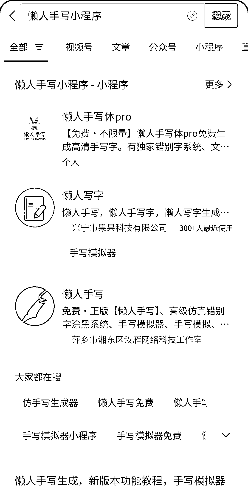
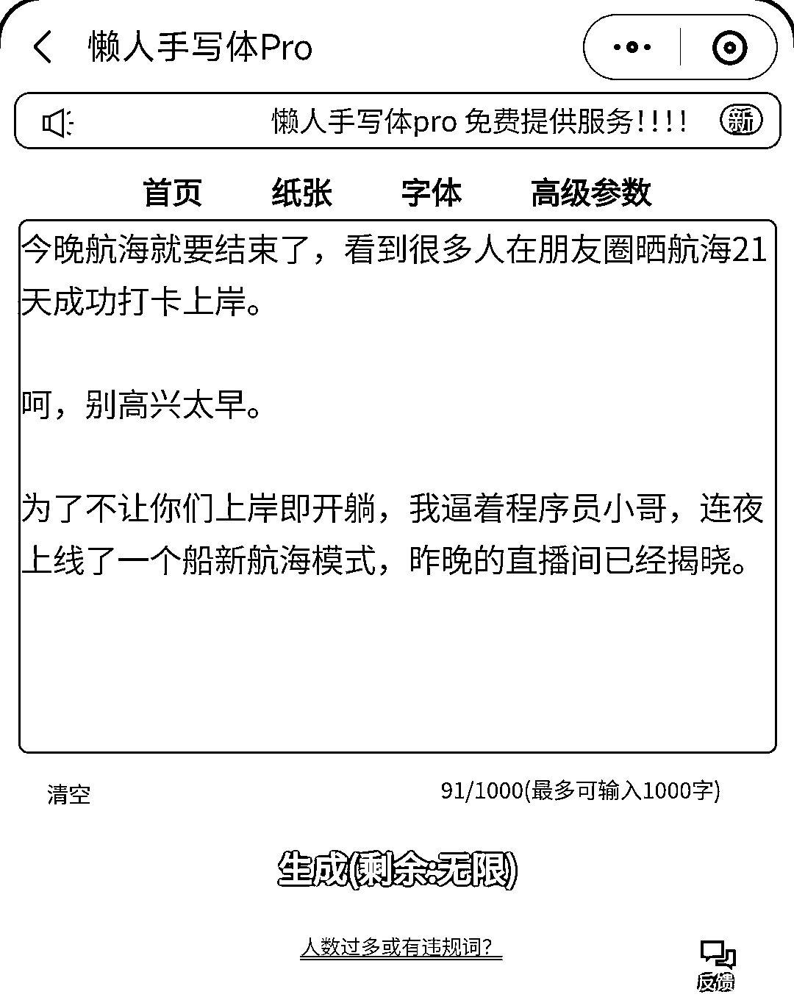
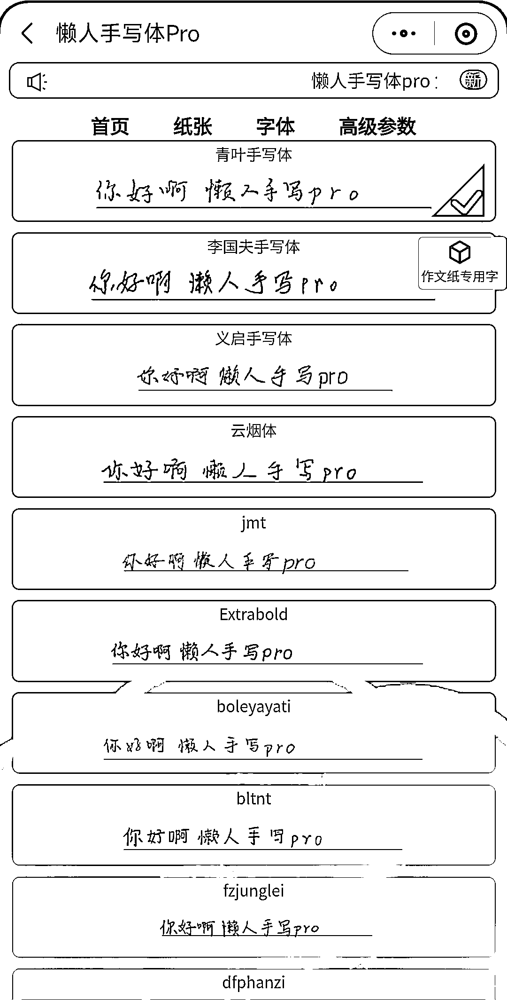
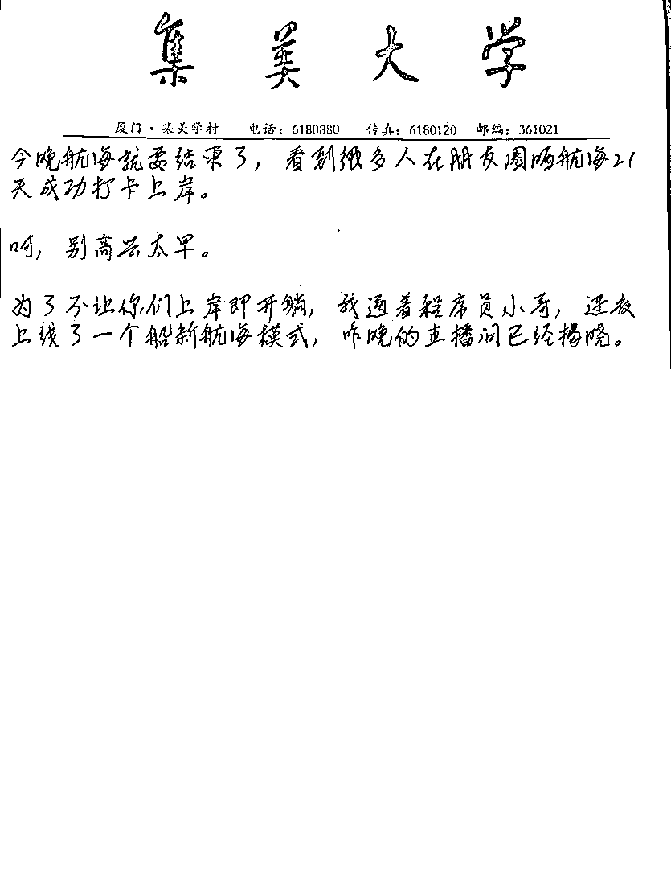
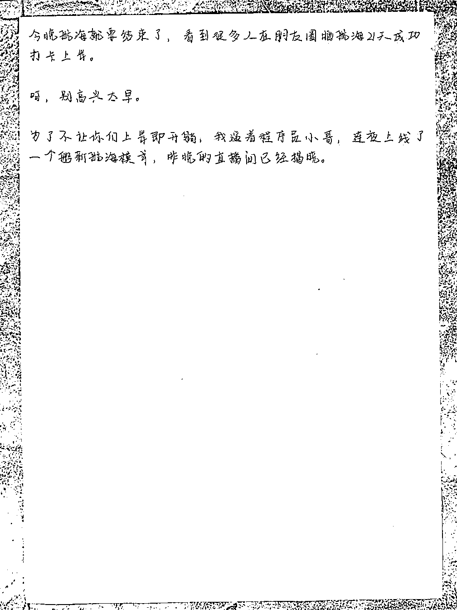

# 手写字直接生成的微信小程序，用起来挺方便

> 原文：[`www.yuque.com/for_lazy/xkrm14/na7wsskdc6yfhuza`](https://www.yuque.com/for_lazy/xkrm14/na7wsskdc6yfhuza)

作者： 幻景

日期：2023-06-14

点赞数：140

正文：

手写字直接生成，这样的微信小程序挺方便。 纸张、字体都可以选择，可以设置各种参数。 也可以自定义纸张类型，用起来也挺方便。

  

评论区：

也许吧 : 集大校友？

倪大胖 : 这个赞

倪大胖 : 有很多应用场景

幻景 : 不是哈，那只是在里面可选的一款纸张

Bill 陈 : 校友？

一直很安静🏇🏾 : 校友啊

秋林 : 小红书很多手写字体的 小问题 数据都很大

