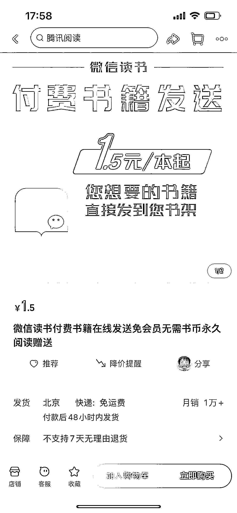

# 微信电子书：3 元一本，月销 1W+

> 原文：[`www.yuque.com/for_lazy/xkrm14/adczz2zqtnc93g2s`](https://www.yuque.com/for_lazy/xkrm14/adczz2zqtnc93g2s)

作者： Zeng Gong

日期：2023-06-15

点赞数：110

正文：

微信电子书，通过二维码导入到微信读书，一本 3 块钱，一个月销量 1 万+。

评论区：

白宝香 : 还能这样，好奇怎么做到的

白宝香 : 为了省事 自己开了个年会员

Zeng Gong : 原理是很简单，跟微信读书本地导入 PDF 或其他电子书是一样的。只能阅读，看不到评论。 具体怎么做到远程导入就是技术活了[捂脸]

白宝香 : 好的谢谢

威曹 : 用网页版微信读书，扫码就是为了在网页端登录，直接文件拖进去就可以了。

Zeng Gong : 这样的😀明天试一下

Zeng Gong : 😀谢谢亦仁老大，开心～

公众号懒人找资源，懒人专属群分享

