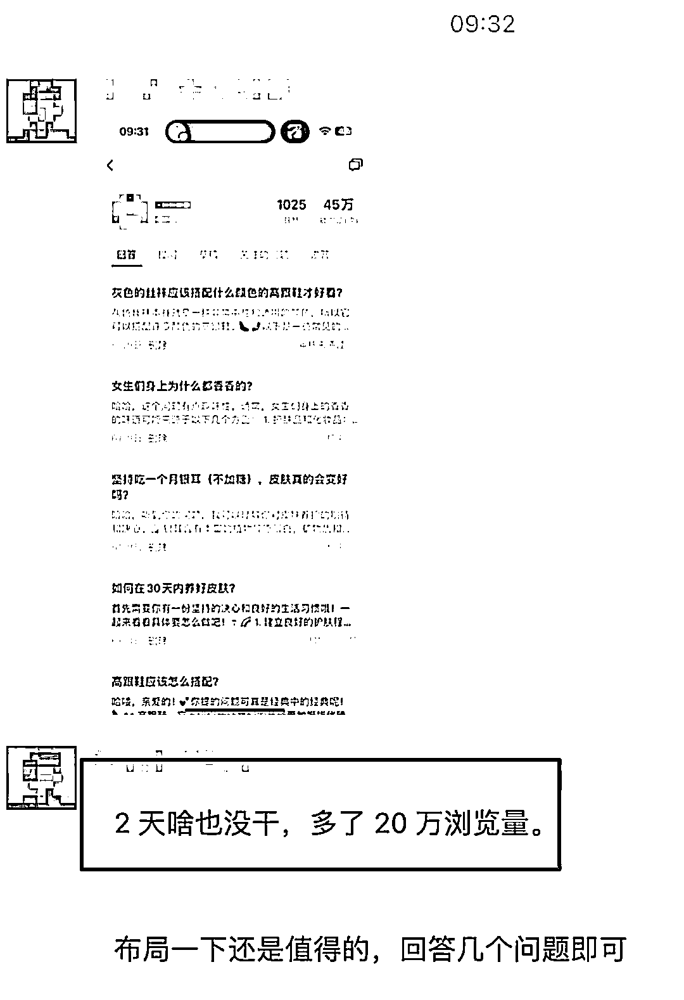

# 微信问一问课程开售，抓住新兴市场风向

> 原文：[`www.yuque.com/for_lazy/xkrm14/zouco1rhwo3gcddv`](https://www.yuque.com/for_lazy/xkrm14/zouco1rhwo3gcddv)

作者： 元峰

日期：2023-06-13

点赞数：91

正文：

针对微信问一问的课程已经开卖了

  

  

  

评论区：

胡洋 : 这执行力杠杠的

小沫 : 谢谢推荐这是我们探火研发的课程

元峰 : [机智]

兰心 : 我的后台没问一问呢，新版本吗

晴天哥哥 : 星球里有教程的，你搜一搜啦[玫瑰]

元峰 : 直接搜问一问，或者进搜一搜随便问个问题就出来。

Mr.冯 : 能私下介绍下？

