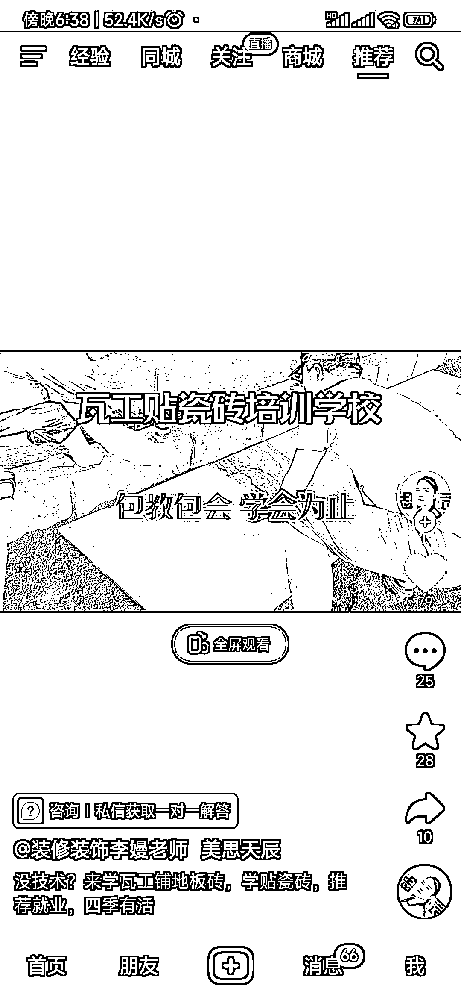

# 抖音成传统行业技能培训新蓝海

> 原文：[`www.yuque.com/for_lazy/xkrm14/venxmohu2uvgqr2e`](https://www.yuque.com/for_lazy/xkrm14/venxmohu2uvgqr2e)

作者： 叶华

日期：2023-06-13

点赞数：81

正文：

传统行业技能培训在抖音大有可为。 这个账号矩阵化在抖音做了很久了，当大家都在拼 it 教育，或者自媒体，写作教育的时候，这些下沉市场反而是蓝海。

评论区：

Mr. 胡添翼 : 这个反向开车思路真不错

