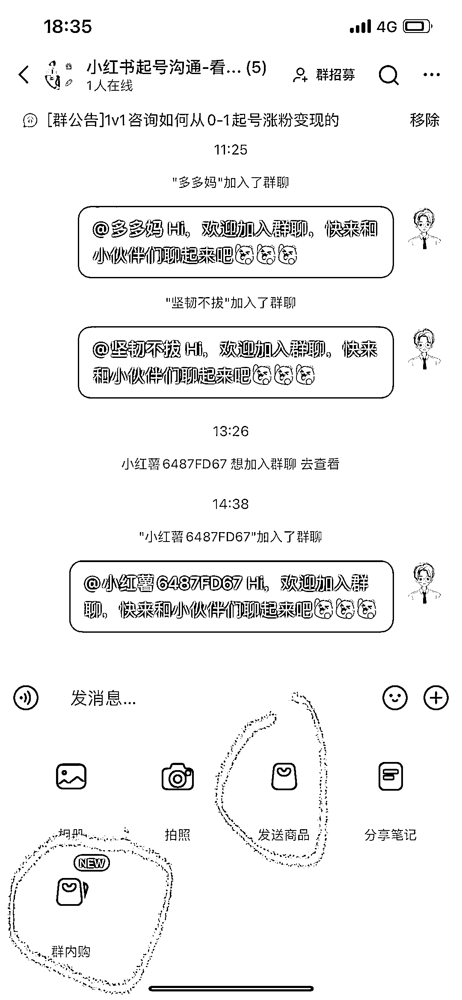
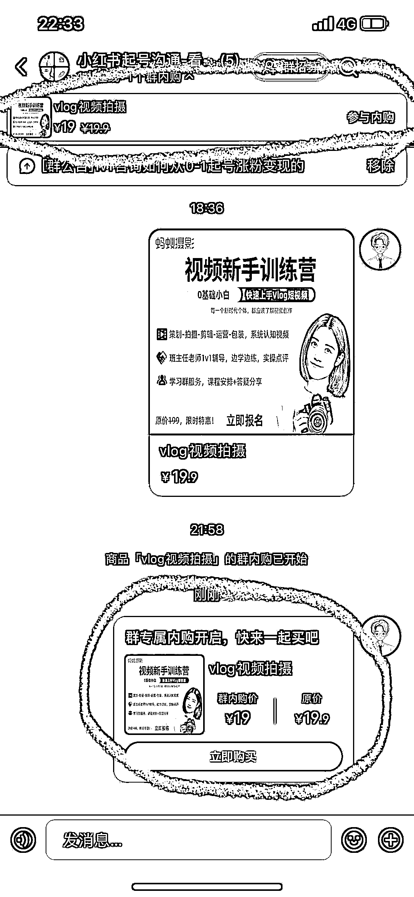
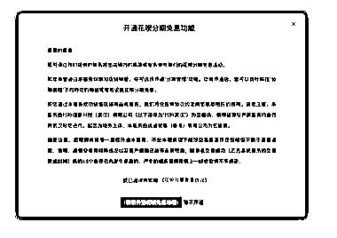

# 小红书群内购+分期付款，私域运营的大利好

> 原文：[`www.yuque.com/for_lazy/xkrm14/nkwvisgw99dis7mr`](https://www.yuque.com/for_lazy/xkrm14/nkwvisgw99dis7mr)

作者： 渡人自渡

日期：2023-06-13

点赞数：80

正文：

对小红书群内购功能➕分期付款功能的思考，根据运营经验，这是一个非常大的利好！ 我有一个想法：思路是可行的。 做过私域运营的都应该了解快闪群，我们之前在小红书的引流转化链路是：从小红书引流到私域，然后私域通过销售，社群，快闪活动变现。 现在直接利用小红书的社群➕群内购功能，就可以完全缩短转化链路，直接把小红书的粉丝吸引到群里，然后直接在群内做快闪活动（见图 1-图 3） 最大的卡点是如何保持群活跃，让用户打开小红书群，以及现在最讨厌的群内截流

评论区：

Jun : 小红薯可以做知识付费吗

渡人自渡 : 可以

Kathleen Z* : 我没有这个功能，是不是得开通小红书店铺才可以有这个功能呀？

渡人自渡 : 是的，你的账号得有店铺

兰心 : 新功能，看到了

Eva : 提高小红书群活跃 那就想办法把以前在微信群做的运营动作搬到小红书群 以及多在小红书搞直播

渡人自渡 : 可以尝试，但问题的关键不是直接搬在微信群的运营动作的问题，而是大家打开微信和打开小红书的打开率的问题，尤其还是打开小红书群

公众号懒人找资源，懒人专属群分享

