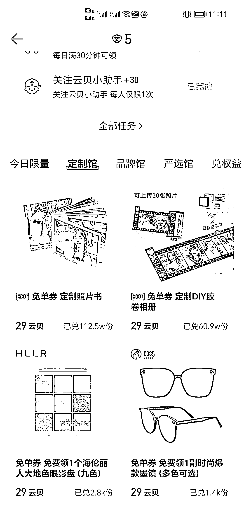
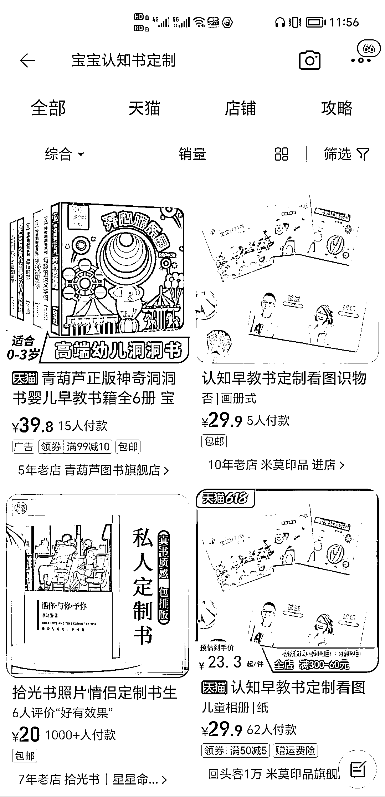
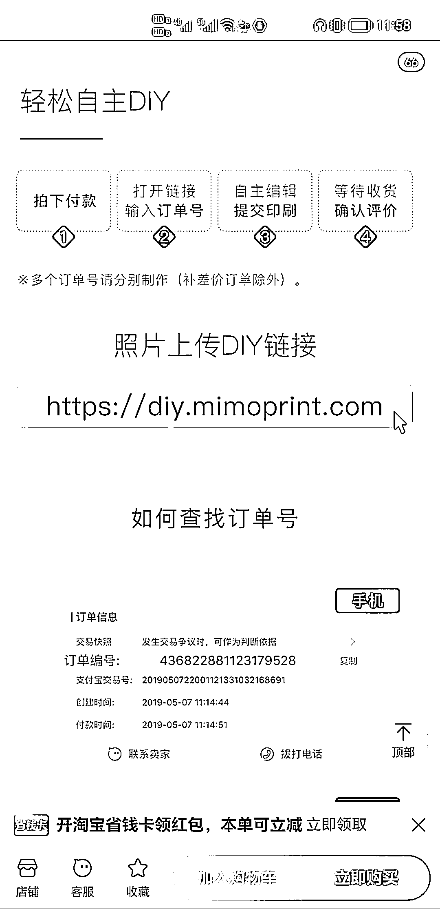

# 宝宝认知早教书定制，很多人愿意付费

> 原文：[`www.yuque.com/for_lazy/xkrm14/nkqrnfgyqaykqox4`](https://www.yuque.com/for_lazy/xkrm14/nkqrnfgyqaykqox4)

作者： 破洞皮蛋

日期：2023-06-13

点赞数：131

正文：

宝宝认知早教书定制(图一) 1.背景是现在的认知早教书上爸爸妈妈爷爷奶奶这些人物都是陌生的外国人，生活用品等也不一定是宝宝生活中熟悉的，所以很多有心的妈妈自己动手给宝宝做专属的认知书 2.现在网易云音乐的云贝中心-定制馆-定制照片书(图三)可以实现书的制作，图片需要自己处理 3.淘宝上做认知书定制的只有一家(图四)，图片需要自己处理(图五) 4.对于一些妈妈，图片处理是最大的卡点(图书主题、排版、p 图等)，能解决这个需求的话，有很多人愿意付费

评论区：

方糖呐 : 看了下小红书的其它教程方案，印鸽小程序就能做，类目是【早教卡】，10 页￥19.9，感觉可以做信息差生意倒一手，不知道这群宝妈愿意出多少钱

金九渊 : 一页 2 块

王左右 : 这个信息差倒卖给宝妈没啥毛病，但有个问题是，这些都不是无痕发货，也就是客户可以通过寄件人手机号码知道是谁发货的，这样信息差就被识破了。大家有什么破解方法吗？

秋闯 : 毕竟少数

胖大魔 : 把聪明人拉进自己群，做代理下线

朱朱侠 : 收藏起来

已阅 de 小窝 : 家有一岁宝妈超级需要

