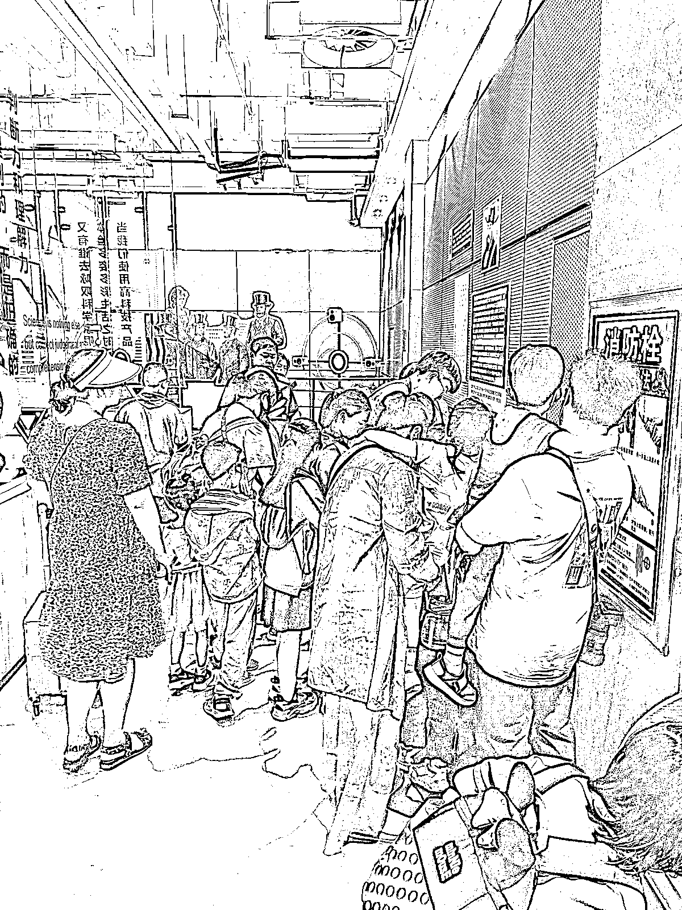

# 低成本短期跨城训练营，带三四线城市孩子去大城市长见识

> 原文：[`www.yuque.com/for_lazy/xkrm14/iiwq51febsho4rz0`](https://www.yuque.com/for_lazy/xkrm14/iiwq51febsho4rz0)

作者： 张热烈啊

日期：2023-06-16

点赞数：93

正文：

短期跨城训练营，低成本带三四线城市孩子去大城市长见识。 昨天陪外甥出去玩，突发奇想。 去的是青岛海信探索中心，也就是科技馆。 对成年人没什么吸引力，对孩子来说简直是天堂。 在这个地方，孩子自发发现各种玩的，激发好奇心，被动学习 家长呢，大大减少的看孩子的精力。 碰到一个双语幼儿园，带队的老师全部都是一色的外国人，boss 是中国人，和小朋友全程直接用英语沟通，起点好高，和他们 boss 聊了一会，收费标准每月 1.2 万，一个班 30 左右人，还有远程线上服务，现在家长都重视教育，这是个很好的赛道。 我的想法是，这种服务，三四线城市父母肯定是消费不起的，但是可以低成本让孩子体验。 举个例子，三四线资源比较少，可以组织烟台的孩子到青岛游玩学习，上午去科技馆，下午让外教带一带，晚上吃当地特色，低成本带孩子长见识，长知识，过程拍成短视频引流。

评论区：

张热烈啊 : 感谢

郝家草莓 : 这个馆还挺贵的

Super 黄 : 有心了！

张热烈啊 : 科技馆不贵，是双语幼儿园贵

张热烈啊 : 突发奇想

东方既白 : 安全风险要做好，小孩子金贵

张热烈啊 : 安全第一

