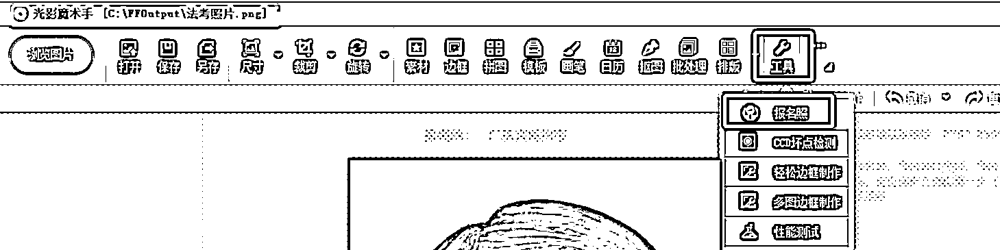

# 一键生成合格照片软件，助力司法及其他考试冲刺培训班

> 原文：[`www.yuque.com/for_lazy/xkrm14/lsv4ec0b0676meuh`](https://www.yuque.com/for_lazy/xkrm14/lsv4ec0b0676meuh)

作者： 徐 Ken

日期：2023-06-16

点赞数：83

正文：

今天开始司法考试报名，其中有一个比较麻烦的事是提交考生照片，要求特殊: 像素 413*626，同时文件大小在 40K 至 100K。 如果用 PS 修改像素大小，可能导致文件大小不符合要求。其他好多软件也会出现类似问题。折腾了将近 40 分钟，最后发现光影魔术手软件可以轻松搞定各种报名考试的照片（如截图）。由此产生一个引流思路: 发帖引流到私域提供一键生成合格照片软件，然后转化司法或其他考试的冲刺培训班。

评论区：

胖大魔 : 这也是一个痛点，细分领域

徐 Ken : 吸引的粉丝比较精准😃

徐 Ken : 多谢亦仁大大😃

不期而遇 : 是的，还有个思路，可以直接做个小工具。引流同时变现

徐 Ken : 自己开发图片工具？适合有开发资源的圈友😂

不期而遇 : 哈哈哈哈哈，可以向人合作啊。

更好*钢铁公司 : 工具软件引流儿。各行各业

