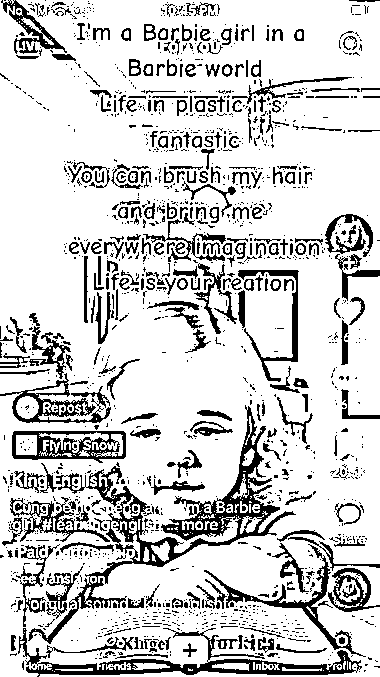
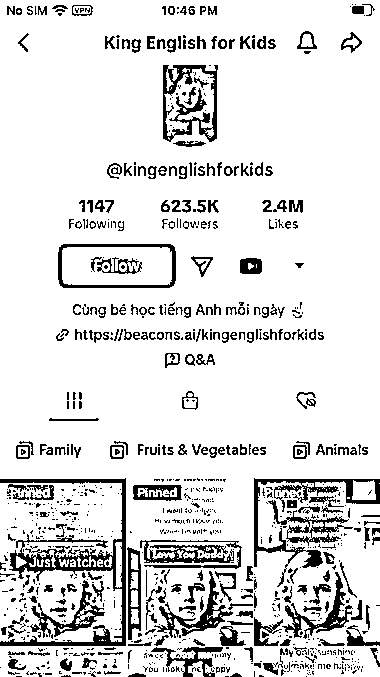

# TikTok 上的 AI 生成小孩英语学习视频，可在抖音、小红书等平台推广

> 原文：[`www.yuque.com/for_lazy/xkrm14/nyrze25t0xut3vua`](https://www.yuque.com/for_lazy/xkrm14/nyrze25t0xut3vua)

作者： 兰心

日期：2023-06-16

点赞数：115

正文：

TikTok 上用 AI 生成的小孩英语学习视频，有唱歌形式，也有叙述形式，很可爱的画面，容易吸引眼球，引导独立站卖课程。 同理可以在国内抖音、小红书或者视频号制作 AI 英语学习视频，直接卖课程或者引导私域成交。

评论区：

兰心 : 感谢亦仁大大，人生第一次中标[玫瑰]

一登 : 就是图片加声音吗？还是说用数字人？

兰心 : ChatGPT 航海里有教程，自己上传图片，数字人加声音

Vicent : 这个不是独立站卖货，要么是 aff，要么是从播放赚收益。 不过流量还是很猛。3 年到这样 很快了

