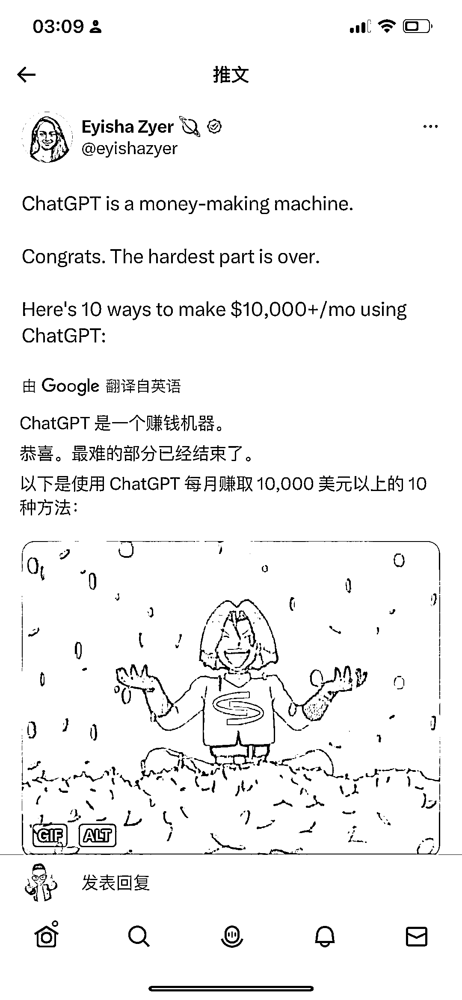
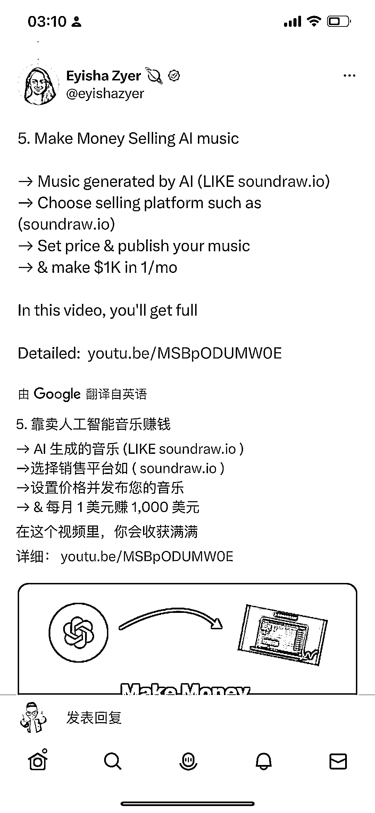

# 使用 ChatGPT 赚取每月超过 10,000 美元的七种方法

> 原文：[`www.yuque.com/for_lazy/xkrm14/mmhnwl59r9zz6h81`](https://www.yuque.com/for_lazy/xkrm14/mmhnwl59r9zz6h81)

<ne-p id="u965abb4a" data-lake-id="u965abb4a"><ne-text id="uf0de6bcf">作者： 🍀刘驴💥</ne-text></ne-p> <ne-p id="u68e1515f" data-lake-id="u68e1515f"><ne-text id="u0a7391af">日期：2023-06-24</ne-text></ne-p> <ne-p id="u7e791e5d" data-lake-id="u7e791e5d"><ne-text id="ubeab1acd">点赞数：</ne-text><ne-text id="ufdd350b7" ne-bold="true">125</ne-text></ne-p> <ne-hole id="u1ffb74f6" data-lake-id="u1ffb74f6"><ne-card data-card-name="hr" data-card-type="block" id="t6zgJ" data-event-boundary="card"><ne-p id="u1d1169e4" data-lake-id="u1d1169e4"><ne-text id="ua6af7a2c">正文：</ne-text></ne-p> <ne-p id="u49b18416" data-lake-id="u49b18416"><ne-text id="u2e9bac5d">使用 ChatGPT 每月赚取 10,000 美元以上的 7 种方法： 1.通过博客/文章赚钱 🔗 2.赚钱销售提示 🔗 3\. 卖 AI 艺术赚钱 🔗 4.</ne-text> <ne-text id="ufe140613">销售数字产品赚钱 🔗 5\. 靠卖人工智能音乐赚钱 🔗 6\. 卖有声读物赚钱 🔗 7\. 卖视频背景赚钱 🔗</ne-text> [<ne-text id="ud3d1ef33">http://youtu.be/Mr0zhG2VIiw</ne-text>](http://youtu.be/Mr0zhG2VIiw) [<ne-text id="u3a6f6bff">http://youtu.be/QORw7FJ5lho</ne-text>](http://youtu.be/QORw7FJ5lho) [<ne-text id="u956a1c4f">http://youtu.be/2psSl6oM0vw</ne-text>](http://youtu.be/2psSl6oM0vw) [<ne-text id="u470da1a1">http://youtu.be/E0qSPO2kdmg</ne-text>](http://youtu.be/E0qSPO2kdmg) [<ne-text id="u89854918">http://youtu.be/MSBpODUMW0E</ne-text>](http://youtu.be/MSBpODUMW0E) [<ne-text id="ubcedc3c1">http://youtu.be/vpQlIm_ms0</ne-text>](http://youtu.be/vpQlIm_ms0) [<ne-text id="ueb8e5078">http://youtu.be/AEgUmWZqvn4</ne-text>](http://youtu.be/AEgUmWZqvn4)</ne-p> <ne-p id="u9b0b8b4b" data-lake-id="u9b0b8b4b"><ne-card data-card-name="image" data-card-type="inline" id="Hzdr5" data-event-boundary="card">  <ne-p id="u452ac488" data-lake-id="u452ac488"><ne-card data-card-name="image" data-card-type="inline" id="Hy0mv" data-event-boundary="card">  <ne-p id="uc2c0e176" data-lake-id="uc2c0e176"><ne-card data-card-name="image" data-card-type="inline" id="Rrhpv" data-event-boundary="card">  <ne-p id="uff8907ab" data-lake-id="uff8907ab"><ne-card data-card-name="image" data-card-type="inline" id="CKOKx" data-event-boundary="card">  <ne-p id="u0cf6444f" data-lake-id="u0cf6444f"><ne-card data-card-name="image" data-card-type="inline" id="H8Pjy" data-event-boundary="card">  <ne-p id="uc42d143e" data-lake-id="uc42d143e"><ne-card data-card-name="image" data-card-type="inline" id="DeVgM" data-event-boundary="card">  <ne-p id="uec378392" data-lake-id="uec378392"><ne-card data-card-name="image" data-card-type="inline" id="wopNI" data-event-boundary="card">  <ne-p id="u4c8fc147" data-lake-id="u4c8fc147"><ne-card data-card-name="image" data-card-type="inline" id="YH2f6" data-event-boundary="card">  <ne-p id="u2fa0c1ac" data-lake-id="u2fa0c1ac"><ne-card data-card-name="image" data-card-type="inline" id="PsR0M" data-event-boundary="card">  <ne-hole id="ucee232e8" data-lake-id="ucee232e8"><ne-card data-card-name="hr" data-card-type="block" id="WX4sO" data-event-boundary="card"><ne-p id="u667424b7" data-lake-id="u667424b7"><ne-text id="u8991db8b">评论区：</ne-text></ne-p> <ne-p id="u00ccc874" data-lake-id="u00ccc874"><ne-text id="udcdfa49d">林家少爷 : 哪些已经跑通了</ne-text></ne-p> <ne-hole id="u5db219ea" data-lake-id="u5db219ea"><ne-card data-card-name="hr" data-card-type="block" id="DlaV1" data-event-boundary="card"><ne-p id="u553616bb" data-lake-id="u553616bb"><ne-text id="ub4e6e936">公众号懒人找资源，懒人专属群分享</ne-text></ne-p></ne-card></ne-hole></ne-card></ne-hole></ne-card></ne-p></ne-card></ne-p></ne-card></ne-p></ne-card></ne-p></ne-card></ne-p></ne-card></ne-p></ne-card></ne-p></ne-card></ne-p></ne-card></ne-p></ne-card></ne-hole>