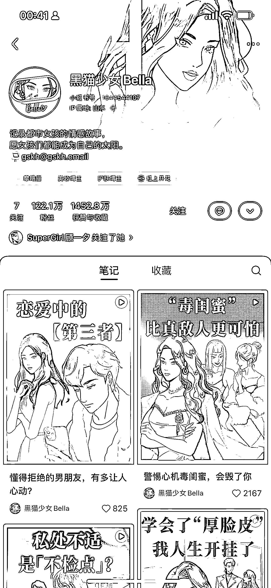
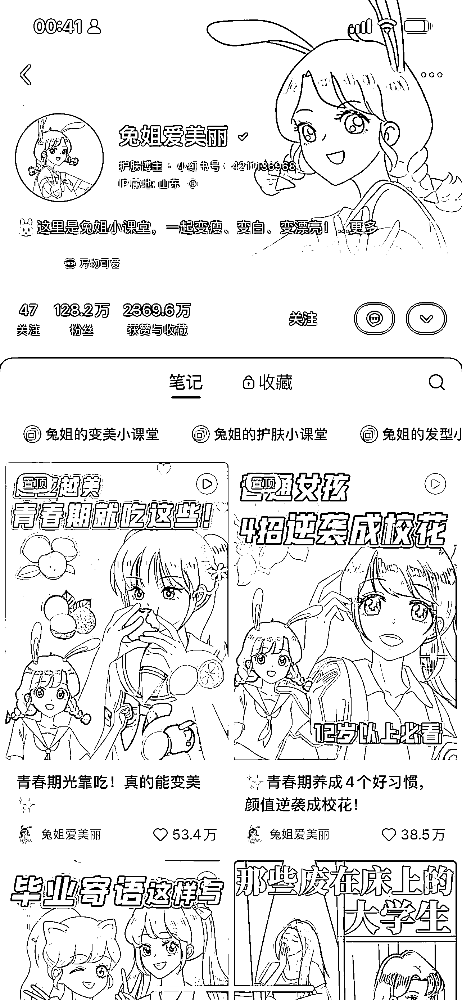
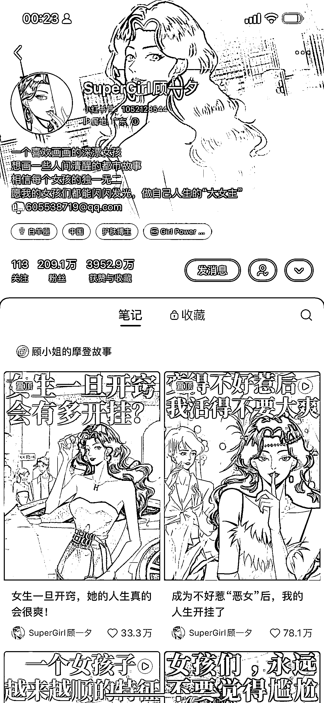
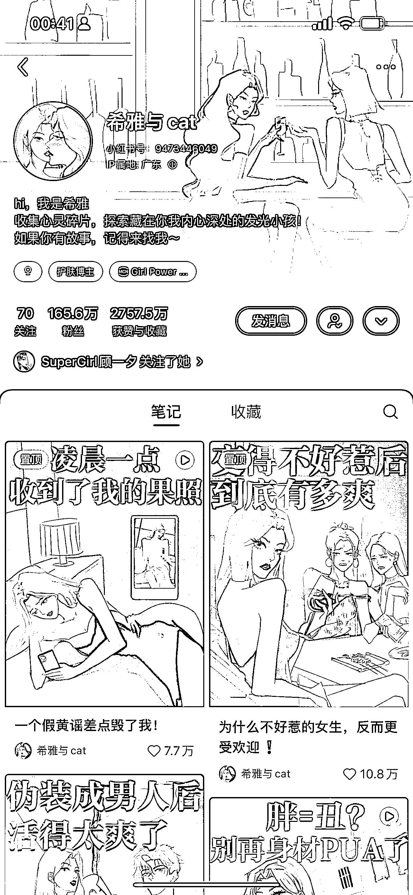
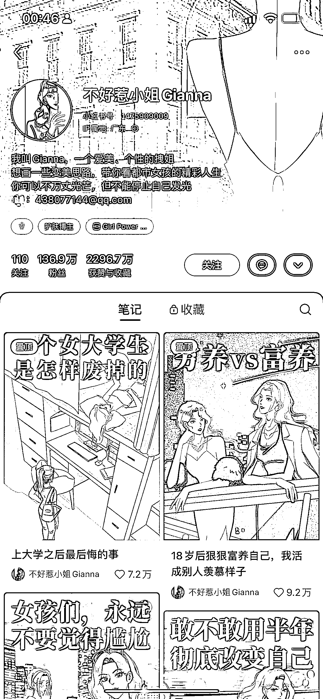
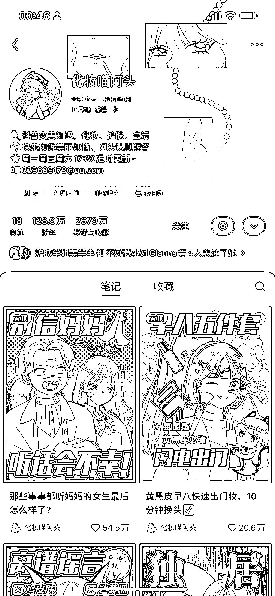
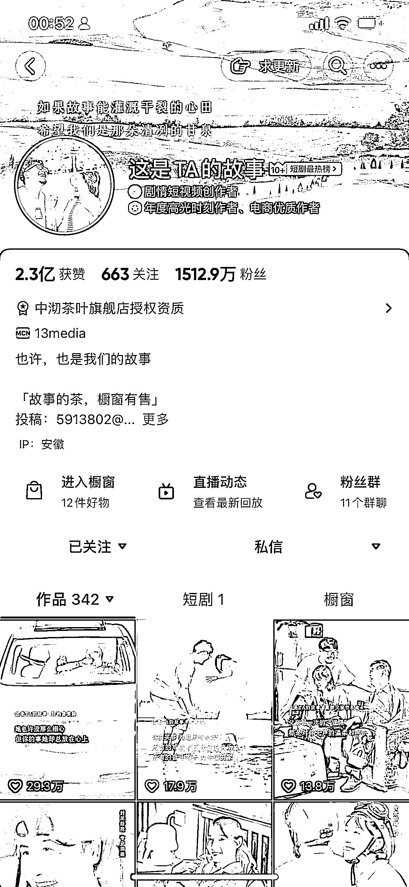

# AI 漫画剧情号在小红书破百万粉，变现主要靠广告

> 原文：[`www.yuque.com/for_lazy/xkrm14/xy59ymw1xrfhzu7t`](https://www.yuque.com/for_lazy/xkrm14/xy59ymw1xrfhzu7t)

<ne-text id="uae5db89b">作者： 🍀刘驴💥</ne-text>

<ne-text id="u093721ac">日期：2023-06-20</ne-text>

<ne-text id="u5b45f9e4">点赞数：</ne-text><ne-text id="ua8a0142f" ne-bold="true">104</ne-text>

<ne-hole id="u9396ae93" data-lake-id="u9396ae93"><ne-card data-card-name="hr" data-card-type="block" id="krTA6" data-event-boundary="card">

<ne-text id="u225e2d1a">正文：</ne-text>

<ne-text id="u37f3e18d">刚刷到一个 ai 漫画系列的小红书账号，真的厉害，基本上都是破百万粉 刷了几十条这种笔记，全是视频展现形式，每条数据都很好，变现主要是接广告</ne-text> <ne-text id="uf3836d37">这种账号之所以涨粉快，原因是博主做的是剧情号，加上 AI 爆火，博主用漫画的形式去做 剧情号本身就具有一定优势，比如： 1、足够吸睛，导致涨粉快</ne-text> <ne-text id="ub148daa8">2、容易直接入广告 3、结合漫画形式，给足产品更大曝光 当然，剧情号也有劣势，比如： 1、用户画像不清晰 2、流量不够精准 3、变现模式单一 做这种 ai</ne-text> <ne-text id="u2270cfd1">漫画剧情号的核心是被广告主看到，这种号是可以规模化</ne-text> <ne-text id="u03672171">如果有朋友去试，切记：一定要用狗血的内容去筛选出你的购物粉（有点公众号爆文逻辑），男粉就别要了，不值钱，所以采用小红书就是一个得天独厚的平台</ne-text>

<ne-card data-card-name="image" data-card-type="inline" id="LV6BJ" data-event-boundary="card">  <ne-p id="ubd1fba0c" data-lake-id="ubd1fba0c"><ne-card data-card-name="image" data-card-type="inline" id="M0EMz" data-event-boundary="card">  <ne-p id="u2ffcb0b8" data-lake-id="u2ffcb0b8"><ne-card data-card-name="image" data-card-type="inline" id="KlhSQ" data-event-boundary="card">  <ne-p id="u4920b344" data-lake-id="u4920b344"><ne-card data-card-name="image" data-card-type="inline" id="ZLEfF" data-event-boundary="card">  <ne-p id="u6e80aca0" data-lake-id="u6e80aca0"><ne-card data-card-name="image" data-card-type="inline" id="Q20l4" data-event-boundary="card">  <ne-p id="u5c340eab" data-lake-id="u5c340eab"><ne-card data-card-name="image" data-card-type="inline" id="ssmm0" data-event-boundary="card">  <ne-p id="u5e3ede39" data-lake-id="u5e3ede39"><ne-card data-card-name="image" data-card-type="inline" id="LuWfa" data-event-boundary="card">  <ne-p id="uba9b6213" data-lake-id="uba9b6213"><ne-card data-card-name="image" data-card-type="inline" id="qPv86" data-event-boundary="card">  <ne-p id="u1ecd9f85" data-lake-id="u1ecd9f85"><ne-card data-card-name="image" data-card-type="inline" id="QwcPK" data-event-boundary="card">  <ne-hole id="u9745891c" data-lake-id="u9745891c"><ne-card data-card-name="hr" data-card-type="block" id="ZCTKs" data-event-boundary="card"><ne-p id="u1c163076" data-lake-id="u1c163076"><ne-text id="ubbed2095">评论区：</ne-text>

<ne-text id="u4205a092">胖大魔 : 画风来自于韩漫日漫几个瑟瑟，还有搞笑的吧 第一次韩漫成人那种 第三个猫眼三姐妹画风</ne-text>

<ne-text id="u1cf134a6">🍀刘驴💥 : 我倒是没怎么关注画风，我主要是看完后，对比了剧情号在抖音和小红书上的区别 抖音剧情号主要是带货，小红书剧情号是按条报价接广告，俩个平台人群不一样</ne-text> <ne-text id="u34472ef4">如果内容做的女粉爱看点，剧情号在小红书或许更能玩赚</ne-text>

<ne-text id="uee2ec145">胖大魔 : 因为我之前有看，画风对用户体验感也很重要，猫眼三姐妹画风审美很棒[呲牙]</ne-text>

<ne-text id="u9ffb043a">亦仁 : 这几个好像不是 ai 画的？</ne-text>

<ne-text id="u3dff4dbc">🍀刘驴💥 : 可以用 ai 绘画做出来 然后剪辑配上故事情节和声音，我这边了解到的是用 python 写的接入 chatgpt 的 api 然后结合 SD 可以自动化生产</ne-text> <ne-text id="u8aaf8197">另外再配一张我做出来的效果</ne-text>

<ne-text id="u092e7127">🍀刘驴💥 :</ne-text>

<ne-text id="u4f429198">亦仁 : 能不能录制一个和小红书那个差不多效果的视频出来？</ne-text>

<ne-hole id="uf8f71941" data-lake-id="uf8f71941"><ne-card data-card-name="hr" data-card-type="block" id="wDj7l" data-event-boundary="card">

<ne-text id="u50e91e4d">公众号懒人找资源，懒人专属群分享</ne-text>

</ne-card></ne-hole></ne-card></ne-hole></ne-card></ne-p></ne-card></ne-p></ne-card></ne-p></ne-card></ne-p></ne-card></ne-p></ne-card></ne-p></ne-card></ne-p></ne-card></ne-p></ne-card></ne-p></ne-card></ne-hole>