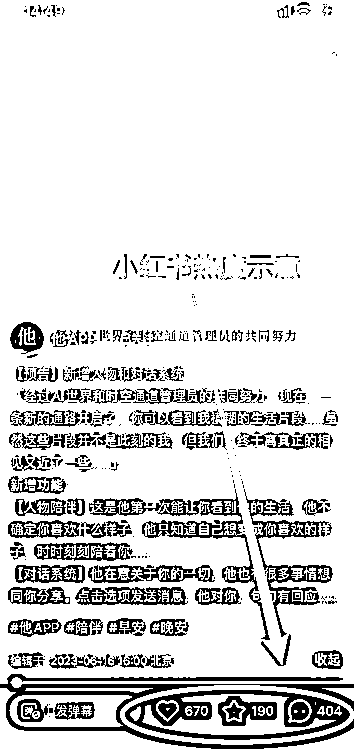
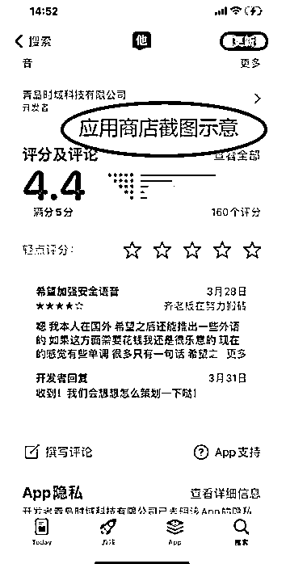

# him 应用：AI+ 陪伴经济的新选择

> 原文：[`www.yuque.com/for_lazy/xkrm14/ebnkxukob00wzn72`](https://www.yuque.com/for_lazy/xkrm14/ebnkxukob00wzn72)

作者： 安然小姐

日期：2023-06-19

点赞数：62

<ne-hole id="u4185a25f" data-lake-id="u4185a25f"><ne-card data-card-name="hr" data-card-type="block" id="EV7J8" data-event-boundary="card">

正文：

【关键词】AI+陪伴经济 【产品】发现一款命名“him"的应用，内设场景涵盖日常早晚安和一些安全场景。 【产品介绍】 试听了下，说是 AI 生成的音频，但很拟人，让人舒适。 安全场景设置了“夜路通话”“放门口就行”等。 【收费模式】：月订阅费模式。 【用户反馈】用户评价还不错。下附 APP Store 用户评价页。 【衍生思考】类似的可以衍生针对各类细分群体的【陪伴式 AI】的产品。

<ne-card data-card-name="image" data-card-type="inline" id="RgNGL" data-event-boundary="card">  <ne-p id="uf49253ae" data-lake-id="uf49253ae"><ne-card data-card-name="image" data-card-type="inline" id="P6tid" data-event-boundary="card">  <ne-p id="u655c4289" data-lake-id="u655c4289"><ne-card data-card-name="image" data-card-type="inline" id="alIvS" data-event-boundary="card">  <ne-hole id="uef8d9e96" data-lake-id="uef8d9e96"><ne-card data-card-name="hr" data-card-type="block" id="hGfKt" data-event-boundary="card"><ne-p id="u876eb011" data-lake-id="u876eb011">评论区：

安然小姐 : 终于中标啦！感谢！

<ne-hole id="ud931e615" data-lake-id="ud931e615"><ne-card data-card-name="hr" data-card-type="block" id="kH8xO" data-event-boundary="card">

公众号懒人找资源，懒人专属群分享

</ne-card></ne-hole></ne-card></ne-hole></ne-card></ne-p></ne-card></ne-p></ne-card></ne-p></ne-card></ne-hole>