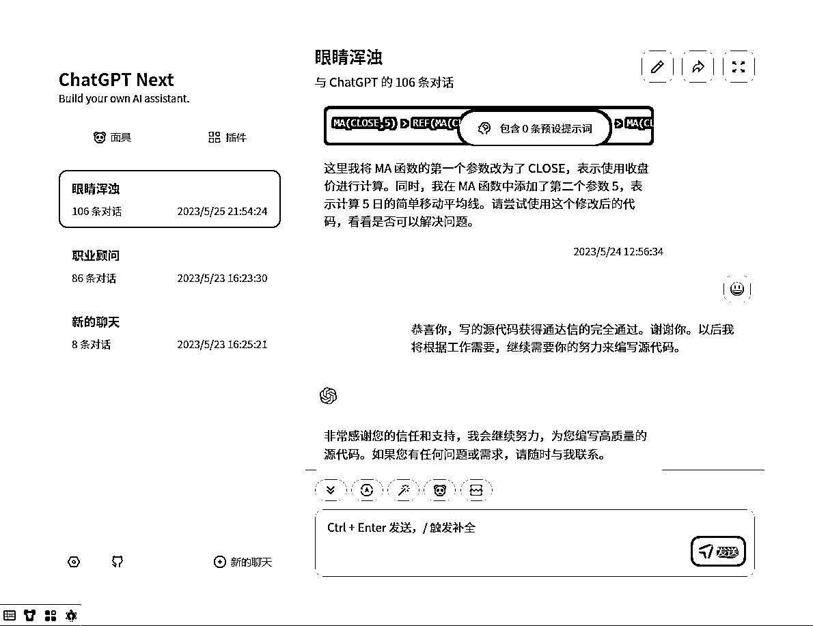

# 退休老股民通过与 ChatGPT 聊天编写选股公式，获得惊人收益

> 原文：[`www.yuque.com/for_lazy/xkrm14/on1nlapvg1oywiwe`](https://www.yuque.com/for_lazy/xkrm14/on1nlapvg1oywiwe)

作者： do 小鱼

日期：2023-06-22

点赞数：44

正文：

前段时间做了个免梯使用的 gpt 给身边的亲友使用。我爸是个退休小老头儿，也是个资深老股民。 端午回家问他 gpt 用的怎么样了，他给我展示说靠 gpt 写出了符合他需求的选股公式我都惊了。 毕竟他一点编程知识都没有，也没有人教他怎么调 prompt，他就是一点点靠耐心和 gpt 聊天，用语言表达需求，让 gpt 写代码，有 bug 了再让它调整，然后调出了选股公式，整个对话 100+条。 他拿着 gpt 给的选股代码，每天能够选出二十几条股票，再人工筛选出符合需求的股票，据说已经做了几个涨停。 翻了下他的聊天对话记录，其他比较多的聊天话题还有如何去做旅游攻略、以及与健康相关的。 chatgpt

  

  

评论区：

Mr.冯 : 图片用的 3.5 怎么联网？

HEXIN : 这个可以看到别人的聊天记录是吗

do 小鱼 : 当然不可以[呲牙]直接在我爸的电脑上看的哈

感恩学习相信-小陶 : 这个太牛了，叔叔天才啊[强][强][强]

公众号懒人找资源，懒人专属群分享

</ne-p></ne-p>