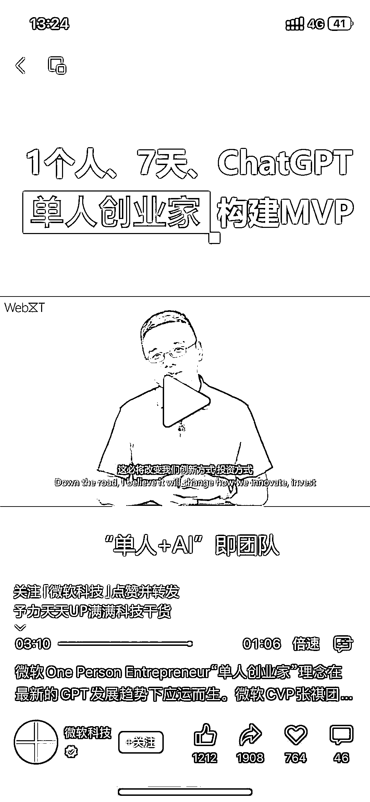

# 微软 One Person Entrepreneur 模式：用 20 美元 ChatGPT 构建 MVP，改变创新路径

> 原文：[`www.yuque.com/for_lazy/xkrm14/zy0wtfymp65qcug9`](https://www.yuque.com/for_lazy/xkrm14/zy0wtfymp65qcug9)

作者： 大卫

日期：2023-06-22

点赞数：25

正文：

微软 One Person Entrepreneur“单人创业家”理念在最新的 GPT 发展趋势下应运而生。微软 CVP 张祺团队的 1 名 PM Kelly，仅花费 20 美元的 ChatGPT 成本、用 7 天时间，即成功取得了产品愿景的重大进展。ChatGPT 为 Kelly 提供了从前端、后端开发到设计师、再到增长工程师（Growth Engineer）的完整小团队支持。张祺认为，从目前来看，“单人+AI”的模式非常适用于构建 MVP，这必将改变我们创新、投资和运营的路径及模式。#AI #ChatGPT #人工智能 #微软 OPE #微软

评论区：

林元陸 : aka 超级个体

公众号懒人找资源，懒人专属群分享

