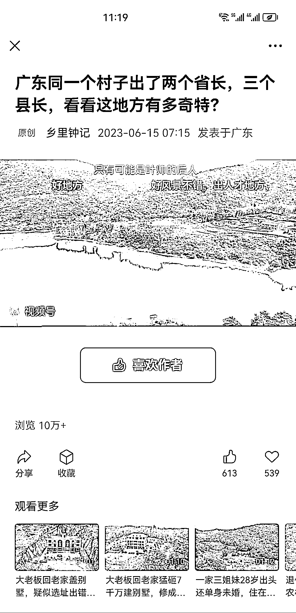
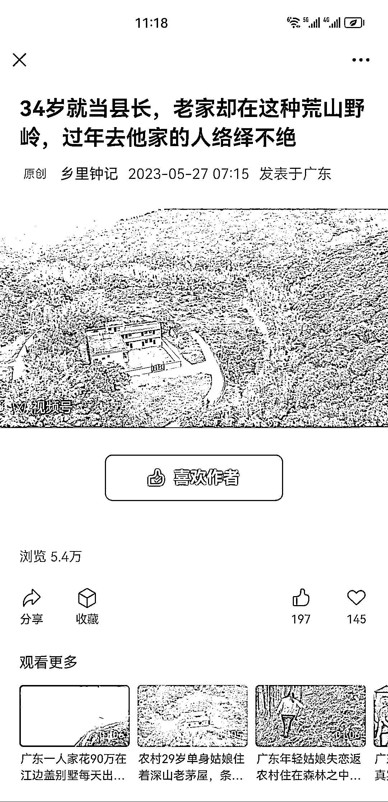

# 公众号视频撸收益，几万到十多万播放的牛逼标题资源研究

> 原文：[`www.yuque.com/for_lazy/xkrm14/ixqo9n55x9w3klrz`](https://www.yuque.com/for_lazy/xkrm14/ixqo9n55x9w3klrz)

<ne-text id="ufe6fd538">作者： 郭耀天</ne-text>

<ne-text id="u834a25ae">日期：2023-06-22</ne-text>

<ne-text id="u8f46fdc0">点赞数：</ne-text><ne-text id="u6630fbc8" ne-bold="true">87</ne-text>

<ne-hole id="ud1905866" data-lake-id="ud1905866"><ne-card data-card-name="hr" data-card-type="block" id="clyeD" data-event-boundary="card">

<ne-text id="ue4c643b7">正文：</ne-text>

<ne-text id="ubc667065">牛逼标题加视频，发公众号撸收益，很多都是几万，十多万播放，有这方面资源可以研究</ne-text>

<ne-card data-card-name="image" data-card-type="inline" id="WUDMt" data-event-boundary="card"></ne-card>

<ne-card data-card-name="image" data-card-type="inline" id="GGPuW" data-event-boundary="card"></ne-card>

<ne-card data-card-name="image" data-card-type="inline" id="iI4TN" data-event-boundary="card"></ne-card>

<ne-hole id="u5389d738" data-lake-id="u5389d738"><ne-card data-card-name="hr" data-card-type="block" id="HYqwL" data-event-boundary="card">

<ne-text id="u9f1d7901">评论区：</ne-text>

<ne-text id="u9d007026">A 潘典 君和联行 : 这个之前有刷到过类似的 就是无人机航拍视频加上一个吸睛文案是不是</ne-text>

<ne-text id="u89dd9dc2">亦仁 : 没看到广告？</ne-text>

<ne-text id="ud8d21171">郭耀天 : 底部</ne-text>

<ne-text id="uea3e6165">朱胜 : 这个玩法感觉比 AI 绘画+情感文容易一些，我怀疑这些视频就是淘宝上面买的，他每天往视频号发几个，然后公众号这边写文章关联视频号的视频就行了，重点就是牛逼标题+视频，容易吸引人。</ne-text>

<ne-text id="u605fcd08">郭耀天 : 是的，这些都是玩法呢</ne-text>

<ne-text id="ufec82669">张优勋 : 我咋感觉这个有点卖风水点穴百图的嫌疑，搞不好是卖书的，那利润比广告收益高很多倍</ne-text>

<ne-text id="udf5983e8">郭耀天 : 有可能</ne-text>

<ne-hole id="ua30baf5e" data-lake-id="ua30baf5e"><ne-card data-card-name="hr" data-card-type="block" id="bEzF7" data-event-boundary="card">

<ne-text id="u20e62ca0">公众号懒人找资源，懒人专属群分享</ne-text>

</ne-card></ne-hole></ne-card></ne-hole></ne-card></ne-hole>