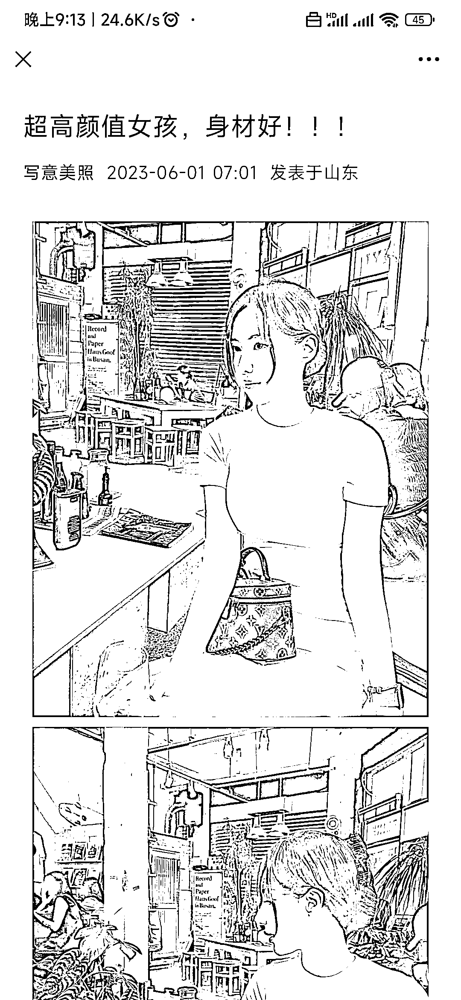
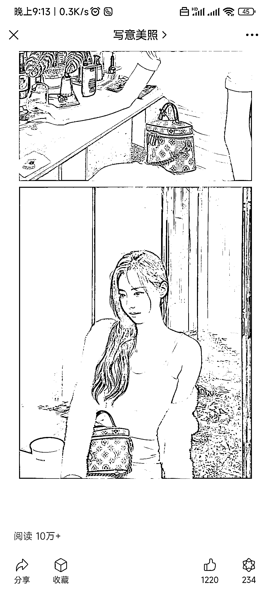

# 公众号写作流量主变现：美女图片方向，流量大，变现轻松

> 原文：[`www.yuque.com/for_lazy/xkrm14/mhhxn9rgt26ad2a9`](https://www.yuque.com/for_lazy/xkrm14/mhhxn9rgt26ad2a9)

作者： 叶华

日期：2023-06-23

点赞数：103

<ne-hole id="ua0213122" data-lake-id="ua0213122">

正文：

公众号写作流量主变现之美女图片方向。 男粉，s 粉，甚至是爱美之心，这类粉丝在网络上最多。这个方向流量大，内容制作简单，项目完全合规不擦边。版权问题完全可以用 ai 绘画解决。流量有了，变现通过流量主广告变现，在公众号文章信息流机制下很容易出 10 万+

<ne-hole id="u86e416c3" data-lake-id="u86e416c3">

评论区：

小武武 : 这个厉害 看了简介 刚注册号也没多久 ，流量很高

老彭 : 流量主一天能赚多少钱啊，这种很难标原创啊

在路上 : 我也刷到了

叶华 : 适合个人矩阵化操作

老传 : 我朋友在做，1W 阅读 20-30

垚垚 : 请问下，这个在发布的时候有没有什么讲究，我最近每次都选群发，原创，类型选壁纸，然后连续 6 天都是只有我和我老公 2 个阅读，是不是操作有啥不对啊？

叶华 : 这个时候是给你安利一下生财的公众号爆文写作小航海了，保姆级教程，重点是免费

<ne-hole id="ua72d25e5" data-lake-id="ua72d25e5">

公众号懒人找资源，懒人专属群分享

</ne-hole></ne-hole></ne-hole>