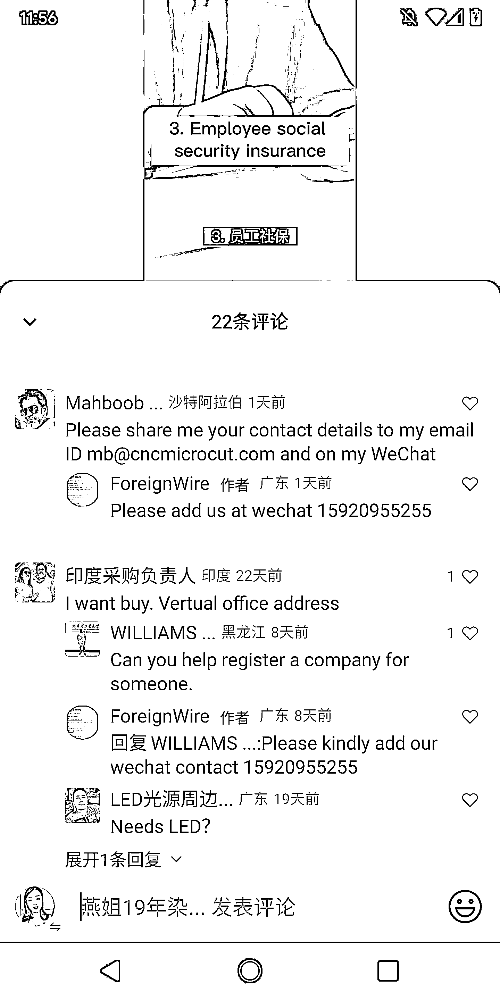

# 视频号成为外贸 B 端的宝贵询单流量渠道

> 原文：[`www.yuque.com/for_lazy/xkrm14/mlvkhv60xoxbbv61`](https://www.yuque.com/for_lazy/xkrm14/mlvkhv60xoxbbv61)

作者： one 先生

日期：2023-06-20

点赞数：70

正文：

发现视频号的流量，不单单是中国的中老年人，还有一部分流量是老外。 视频号可以做老外的生意，非常多的老外使用微信，他们会刷视频号，看到不错的产品，会留言，还会加微信。 图片中的视频号就是专门给老外做企业服务的账号。做好起来非常有价值。 视频号是做外贸 B 端的工厂非常不错的询单流量渠道。 我的一个微信号已经加了小几百人来中国进货的 B 端小老外了。 做外贸的赶紧行动起来。

评论区：

七月 : 涨知识了，之前真的只是以为视频号只有中国人

胖大魔 : 6

健叔的 jian : 那同理是不是抖音和小红书也能做。做个外贸买手。

one 先生 : 小红书也是不分国内和国际版的，抖音国际版有了 TikTok 应该就没什么国外流量了

朱明晔 : 谢谢！有提醒到我

公众号懒人找资源，懒人专属群分享

