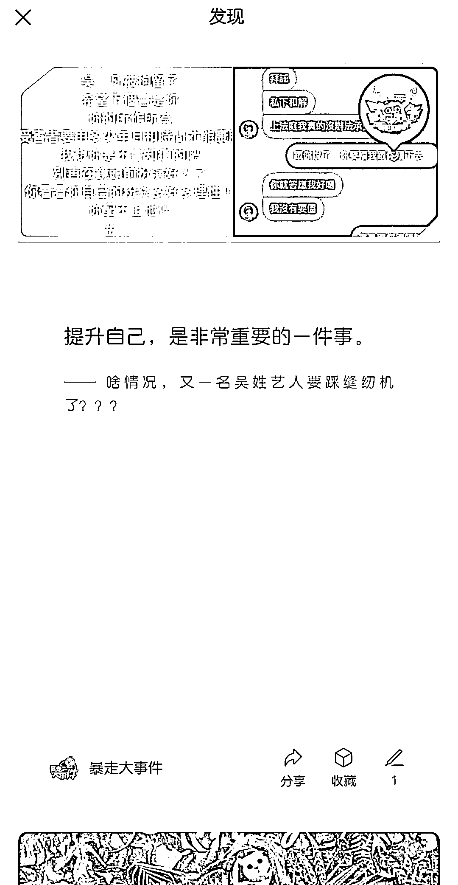

# 订阅号推出新功能，允许划线公众号文章中的内容

> 原文：[`www.yuque.com/for_lazy/xkrm14/sw562crchqskv909`](https://www.yuque.com/for_lazy/xkrm14/sw562crchqskv909)

作者： 森

日期：2023-06-21

点赞数：55

正文：

订阅号新出了“发现”栏目，开始推送公众号文章划线内容！ 文章要有图片，可以自己划线！

  

  

评论区：

书情小跟班 : 这信息真新

李映彤 : 请问一下，自己怎么划线？

森 : 选中文章中一句话，就会出现“划线”选项

海绵践行 : 这几天看到了不少，没关注的也会推荐

一笑 : 这项功能应该还在灰度测试吧？我两个微信小号翻了下，都没看到呢

公众号懒人找资源，懒人专属群分享

