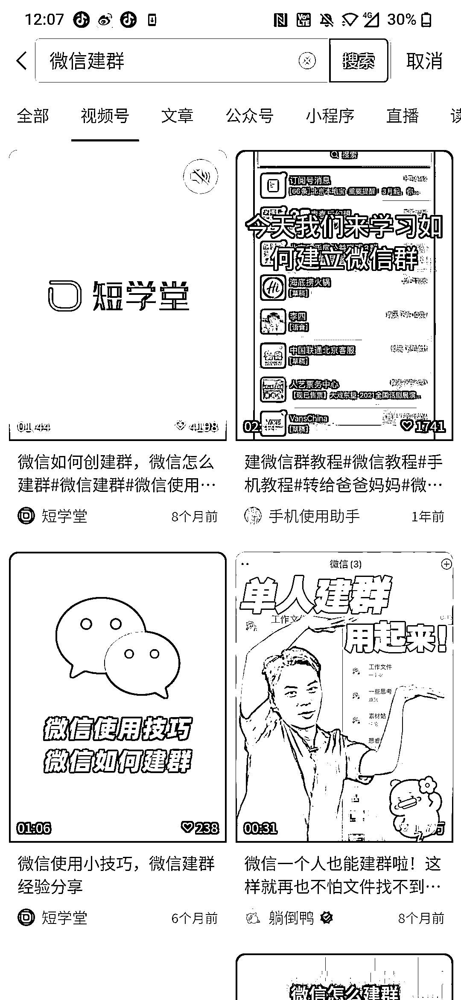

# 微信群建立的搜索趋势分析及应用前景

> 原文：[`www.yuque.com/for_lazy/xkrm14/xti31az7kzdherae`](https://www.yuque.com/for_lazy/xkrm14/xti31az7kzdherae)

作者： 虚十七

日期：2023-06-20

点赞数：66

<ne-hole id="u73720708" data-lake-id="u73720708">

正文：

微信群异常值分析 背景：初衷是搜索某个采集工具，发现在搜索引擎有以下联想，其中一个是【微信怎么建群】，我们属于早期就开始使用微信的人，自然非常熟悉，那究竟是什么样的人在搜索【微信怎么建群】，以及有多少人搜索【微信怎么建群】 数据： 1\. 百度搜索指数，见图一图二，基本上是 30-39，40-49，50+ 人群在搜索 2.微信指数，考虑到移动端渗透率比较多，因此可以看看微信搜索指数，见图三，这个量级已经开始不少了，并且还有很多长尾词没收纳。且来源主要来源于视频号和搜一搜。 分析：尽管中老年人的移动设备渗透率已经非常高，大家基本都在使用微信，但是对于微信的诸多功能其实是需要普及的，否则部分人可能不知道怎么用。 应用： 1.流量主：见图五图六，对比该公众号下其他文章明显有更高的流量。也就是专门切中老年人如何使用微信的细分领域，甚至还能切入中老年人领域各种操作上的问题 2.视频号：前期通过此方针获取粉丝受众，后续转其他产品交付，就不多说

<ne-hole id="u1ac2e8ea" data-lake-id="u1ac2e8ea">

评论区：

陈真 : 再送一个，看图，官方的，里面是视频。

虚十七 : 赞，不过估计好些人也不知道

陈真 : 我之前也不知道，看了你这个搜出来的😁

<ne-hole id="u1277e588" data-lake-id="u1277e588">

公众号懒人找资源，懒人专属群分享

</ne-hole></ne-hole></ne-hole>