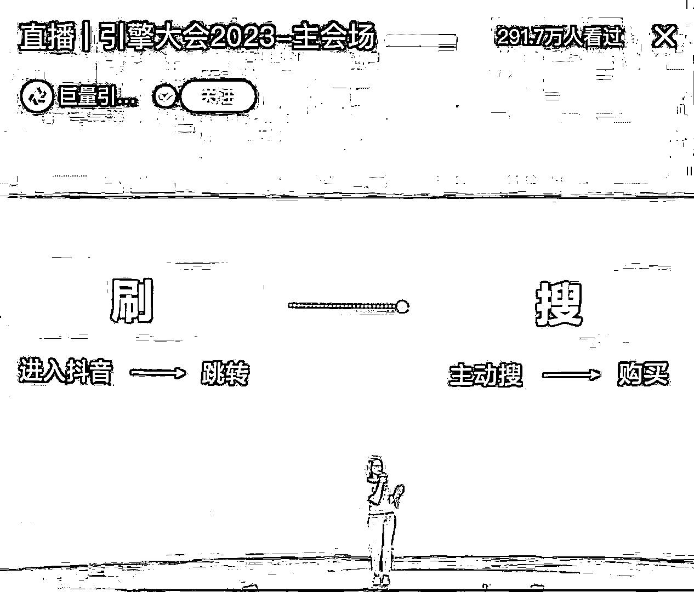
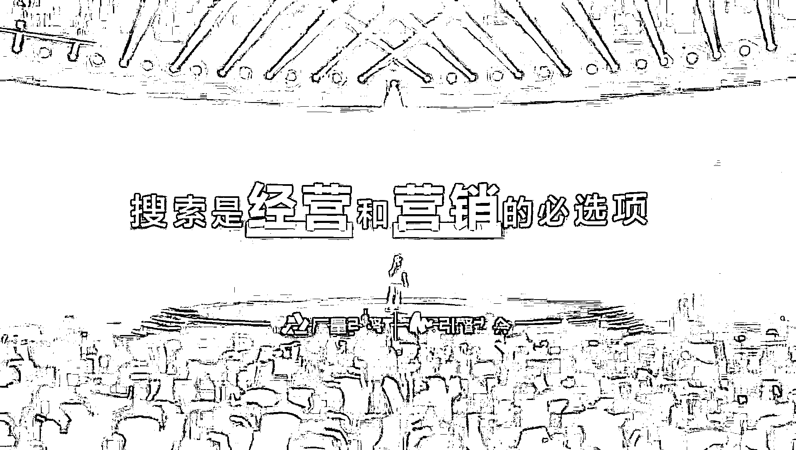

# 抖音改变 slogan，重点打造行业关键词，从 SEO 中增长获客份额

> 原文：[`www.yuque.com/for_lazy/xkrm14/zvxigdd1939w7roa`](https://www.yuque.com/for_lazy/xkrm14/zvxigdd1939w7roa)

<ne-p id="u7daa6d8f" data-lake-id="u7daa6d8f"><ne-text id="ub8df891b">作者： 阿 may</ne-text></ne-p> <ne-p id="u84acf5de" data-lake-id="u84acf5de"><ne-text id="ufb71b833">日期：2023-06-21</ne-text></ne-p> <ne-p id="u6e87307d" data-lake-id="u6e87307d"><ne-text id="u01e22f31">点赞数：</ne-text><ne-text id="u5ec5968a" ne-bold="true">54</ne-text></ne-p> <ne-hole id="uacf2e4aa" data-lake-id="uacf2e4aa"><ne-card data-card-name="hr" data-card-type="block" id="ZkHZ5" data-event-boundary="card"><ne-p id="u5594d255" data-lake-id="u5594d255"><ne-text id="uaf891098">正文：</ne-text></ne-p> <ne-p id="u39318358" data-lake-id="u39318358"><ne-text id="ud435f228">抖音已改 slogan，改为“搜好出‬生活，搜‬出新生意”</ne-text> <ne-text id="u03dfd918">抖音今年官‬宣加大搜索市场份额，各行各业都应该重点布局搜索赛道，今年做抖音一定要重点打造自己的行业关键词，从 seo 中增长获客份额</ne-text></ne-p> <ne-p id="ud77a14cb" data-lake-id="ud77a14cb"><ne-card data-card-name="image" data-card-type="inline" id="Iq3yz" data-event-boundary="card">  <ne-p id="uc043445c" data-lake-id="uc043445c"><ne-card data-card-name="image" data-card-type="inline" id="rbPoq" data-event-boundary="card">  <ne-p id="u48174acb" data-lake-id="u48174acb"><ne-card data-card-name="image" data-card-type="inline" id="TUao5" data-event-boundary="card">  <ne-hole id="ubce7e932" data-lake-id="ubce7e932"><ne-card data-card-name="hr" data-card-type="block" id="RUeVn" data-event-boundary="card"><ne-p id="u5cae69ef" data-lake-id="u5cae69ef"><ne-text id="udf18a7dc">评论区：</ne-text></ne-p> <ne-p id="uc7d9fc37" data-lake-id="uc7d9fc37"><ne-text id="u8d6c1c50">阿 may : 抖音估计会跟百度一样，推出竞价排名策略</ne-text></ne-p> <ne-p id="u51a7372d" data-lake-id="u51a7372d"><ne-text id="ud4075245">Mr.汉松 : 抖音搜索是一个还未过度开发的资源</ne-text></ne-p> <ne-p id="u0c5049ae" data-lake-id="u0c5049ae"><ne-text id="ue63845cc">胖大魔 : 感觉相互侵占市场</ne-text></ne-p> <ne-p id="ucdae1b33" data-lake-id="ucdae1b33"><ne-text id="ud3afcf38">野鸭冲锋队 : 抖音 SEO 工具大有可为</ne-text></ne-p> <ne-hole id="u941d22ab" data-lake-id="u941d22ab"><ne-card data-card-name="hr" data-card-type="block" id="HfvO3" data-event-boundary="card"><ne-p id="u062b0d81" data-lake-id="u062b0d81"><ne-text id="u5160b592">公众号懒人找资源，懒人专属群分享</ne-text></ne-p></ne-card></ne-hole></ne-card></ne-hole></ne-card></ne-p></ne-card></ne-p></ne-card></ne-p></ne-card></ne-hole>