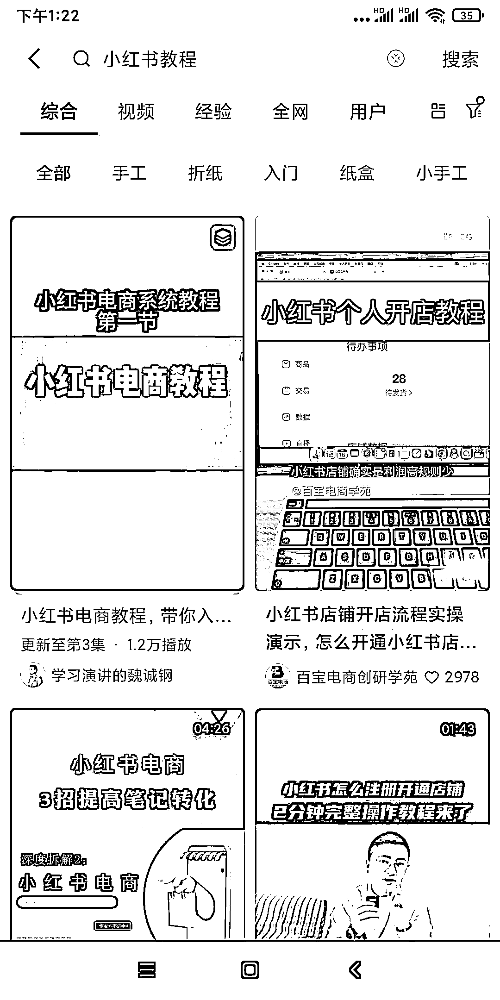
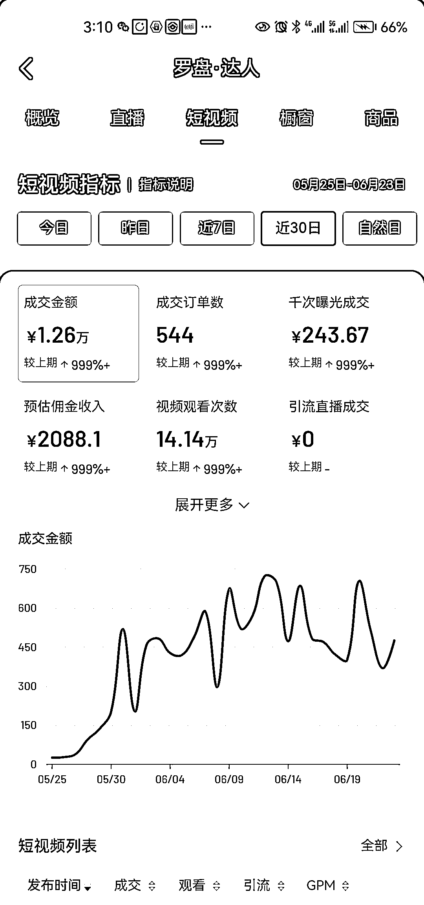

# 抖音 SEO：搜索流量大有可为，测试两个号的成功案例分享

> 原文：[`www.yuque.com/for_lazy/xkrm14/zpu1g84xrkbh1t5g`](https://www.yuque.com/for_lazy/xkrm14/zpu1g84xrkbh1t5g)

作者： AT 魏诚钢

日期：2023-06-24

点赞数：65

<ne-hole id="uf225028d" data-lake-id="uf225028d"><ne-card data-card-name="hr" data-card-type="block" id="TrSV9" data-event-boundary="card">

正文：

抖音 SEO，搜索流量大有可为。测试了两个号，图一是最近几天做的，抖音搜索小红书教程，第一条视频就是我的（安卓手机，苹果手机搜索会有点区别，但是基本可以排在前几名）每天可以往我公号加 10-20 人；图 2 是老婆做的一个好物带货号无意踩重了一个关键词，啥都不用管一个月都在出单，搜索流量可以关注下。

<ne-card data-card-name="image" data-card-type="inline" id="G0G9e" data-event-boundary="card">  <ne-p id="u34374289" data-lake-id="u34374289"><ne-card data-card-name="image" data-card-type="inline" id="WmoYU" data-event-boundary="card">  <ne-hole id="u912577b9" data-lake-id="u912577b9"><ne-card data-card-name="hr" data-card-type="block" id="M2ZLy" data-event-boundary="card"><ne-p id="u4041e4cf" data-lake-id="u4041e4cf">评论区：

万简 : 是无货源模式吗

<ne-hole id="u8f59412a" data-lake-id="u8f59412a"><ne-card data-card-name="hr" data-card-type="block" id="pzBxe" data-event-boundary="card">

公众号懒人找资源，懒人专属群分享

</ne-card></ne-hole></ne-card></ne-hole></ne-card></ne-p></ne-card></ne-p></ne-card></ne-hole>