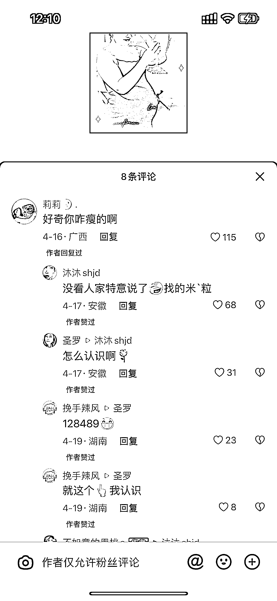

# 抖音引流长尾流量，宝妈方法引人关注

> 原文：[`www.yuque.com/for_lazy/xkrm14/tqfh69cd1yxe5e2l`](https://www.yuque.com/for_lazy/xkrm14/tqfh69cd1yxe5e2l)

作者： 冲冲冲

日期：2023-06-19

点赞数：47

<ne-hole id="ud1b4e52d" data-lake-id="ud1b4e52d"><ne-card data-card-name="hr" data-card-type="block" id="sdBrZ" data-event-boundary="card">

正文：

减肥产品抖音引流，长尾流量 今天刷麦小登视频，无意间看到一个评论，感觉话术挺戳人同情，点进去看了一下主页，只发了两个作品。在置顶作品中发现了引流流量入口。分析了一下，他这种方法确实很牛，现在风控比较厉害，他只用两个作品去做引流引导，平时的工作应该就是去各大博主的评论区写热评，因为他的人设是宝妈，并且相对来说比较真实，没有太多硬的营销，添加之后的转化应该会比较高，在做引流的朋友可以学习一下

<ne-card data-card-name="image" data-card-type="inline" id="cJWa3" data-event-boundary="card"></ne-card>

<ne-card data-card-name="image" data-card-type="inline" id="cfKln" data-event-boundary="card"></ne-card>

<ne-card data-card-name="image" data-card-type="inline" id="NshHf" data-event-boundary="card"></ne-card>

<ne-hole id="ud50f0b41" data-lake-id="ud50f0b41"><ne-card data-card-name="hr" data-card-type="block" id="kN6qj" data-event-boundary="card">

评论区：

<ne-hole id="u3d8f3f66" data-lake-id="u3d8f3f66"><ne-card data-card-name="hr" data-card-type="block" id="rnzMl" data-event-boundary="card">

公众号懒人找资源，懒人专属群分享

</ne-card></ne-hole></ne-card></ne-hole></ne-card></ne-hole>